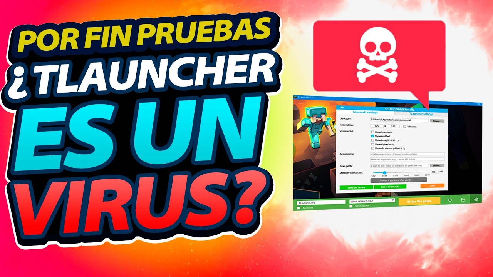
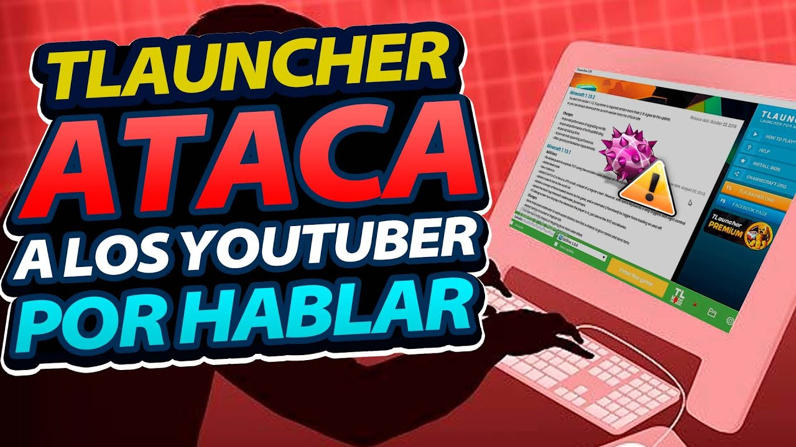
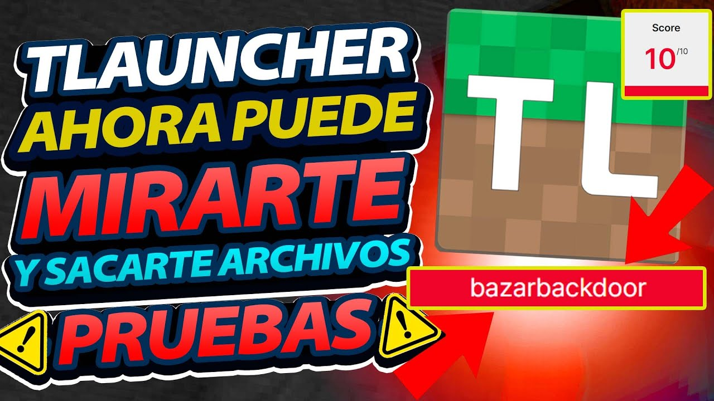
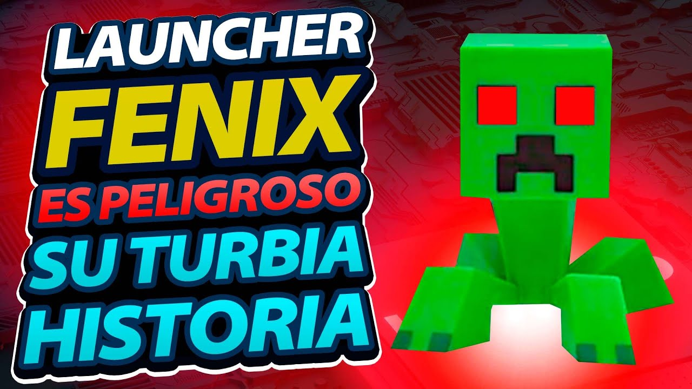
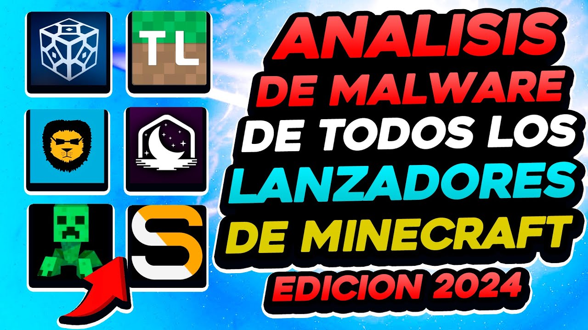

# La Migueleada y sus consecuencias
- En este Repositorio se intentará responder a todos los vídeos que hizo [Miguel Gamer](https://www.youtube.com/@soymiguelgamer) sobre los lanzadores de *Minecraft: Java Edition*.
- Pese a que la idea original es responder a todo lo que pasó con [SKlauncher](https://skmedix.pl/), me veo en la obligación de analizar todos los vídeos porque dice que "*SK es peor que TL*".

## Aviso
- Está perfecto que no descargues y ejecutes los archivos de una sin mirar.
  - Si esperas al menos 24 horas, mejor. Esto es asumiendo que sos el primero en analizarlo y no que alguien más ya lo hizo hace 24 horas (o más).
- Está perfecto que analices las cosas con [VirusTotal](https://www.virustotal.com/), [Triage](https://tria.ge/) y/u otros.
- Está perfecto que quieras apoyar a los creadores ¿Te gusta el juego? ¿Ya viste que te funciona? Andá ahorrando y compralo cuando puedas.
  - Podes hacerlo desde el [Sitio Oficial](https://www.minecraft.net/store/minecraft-java-edition) y [Microsoft Store](https://www.microsoft.com/p/apps/9nxp44l49shj) como opciones permanentes (pagar una vez).
  - También tenes la opción del [Xbox Game Pass for PC](https://www.xbox.com/games/store/game-pass-para-pc/cfq7ttc0kgq8) (pagar por mes) o simplemente el [Free Trial](https://www.minecraft.net/free-trial) (temporal).
  - Los sitios donde se compran claves también son una opción, pero tenes que revisar a quien le comprás y, sobre todo, rezar que las claves no sean robadas (ya que es perjudicial para ambos: el creador gasta dinero en analizar que efectivamente la clave es robada y a vos luego te quitan el juego).

> [!NOTE]
> Yo (*SoyRA*) me uní a SKlauncher en 2018 tras analizarlo fuertemente, en 2021 me dieron el rol de Tester (de gratis, sin pedirlo ni nada) y así sigo hasta el día de hoy.\
> Voy a intentar ser lo más neutral y objetivo posible como también espero tener total colaboración de SKmedix como de Miguel ya que hay puntos que necesitaré la cooperación de ambos (explicaciones, enlaces, etc.).
>
> A ambos les oculté todo lo máximo posible para evitar que cualquiera de los dos intente falsear información.

> [!IMPORTANT]
> Intento limitarme a responder con lo que se sabe hasta el momento del vídeo. Esto significa que si en 2020 se dice X pero recién en 2021 se descubre que en verdad es Y...pues no lo pongo (si lo hago, lo especifico).\
> También respondo como si estuviera viendo el vídeo y le estoy dejando un comentario...muy largo. xd
>
> Y lo más importante: todo lo escribí yo, todo lo busqué yo...si luego Miguel/SKmedix me aportaron algo más, lo especificaré. Y sobre todo: no pienso analizar/marcar falacias, intentos de manipulación, etc. Yo voy a reventar sus argumentos, no si me pusieron "UwU" para intentar ablandarme el corazón. xd\
> &nbsp; \* A menos que sea exagerado e imposible de evitar mencionar.
>
> PD: Es muy recomendable ver (y recordar) todo en orden.

***

> \
> 💀 TLAUNCHER 💀 Analizamos el código y NO PODRAS creer lo que encontramos.

> \
> TLAUNCHER Ataca a los YouTuber por hablar (NO PUEDE SER 🤦‍♂️)

> \
> CUIDADO!! Salió un NUEVO TLAUNCHER EN SECRETO (Analizamos sus cambios y defensa)

> \
> 🚨 ANALISIS DE MALWARE 🚨 DE Todos los LANZADORES DE MINECRAFT ¿Creías que TLAUNCHER era malo? 😟

> \
> TLAUNCHER METIO UN "BAZARBACKDOOR" en su instalador (pueden mirarte 👀 y llevarse tus archivos)

> \
> LAUNCHER FENIX 👉 Su TURBIA historia y el 🚨 PELIGRO 🚨 del lanzador

> \
> SALWYRR ANALIZADO ¿Por que ROMPE el Firewall? - ¿Quiénes estan detrás del lanzador?

> \
> TLAUNCHER Su mayor SECRETO y PELIGRO

> \
> OPTIFINE (Su TURBIA historia y practicas)

> \
> CUIDADO!!! Le agregaron VIRUS: Salwyrr - CM - TLauncher

> \
> SK LAUNCHER - El mas PELIGROSO lanzador de Minecraft

> \
> SK LAUNCHER Engaña a la comunidad de Minecraft ( TE LO PRUEBO )

> \
> BATTLY LAUNCHER - ¡CUIDADO! Lanzador ACUSADO de MIRAR POR LA CAM (Pruebas) - (Habla el creador)

> \
> 🚨 ANALISIS DE MALWARE 2024🚨 De todos los LANZADORES DE MINECRAFT ¿Cuál es seguro y cual no? 😟

> \
> MI PROPIO lanzador NO PREMIUM - (Dos Años trabajando, LO ENSEÑO POR PRIMERA VEZ)
