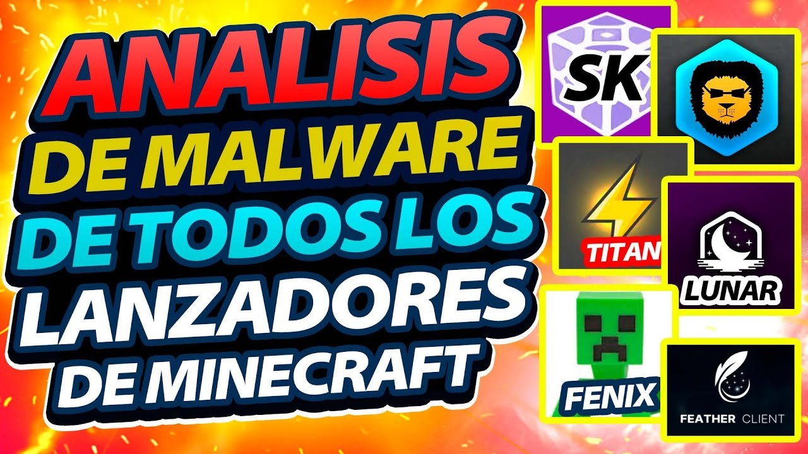

> 0:00 - 0:06 | "Comprobamos que es un malware"\
> 0:46 - 0:48 | "Se demostró que distribuye malware"

Así me gusta Miguel, costó bastante en su momento pero finalmente lo dijiste sin dudas. xd

> 0:58 - 1:00 | "¿Cómo sabemos que son buenos? ¿Y si son malos también?"

Bueno...sacando la parte de intentar analizarlo en sitios como VirusTotal y Triage (que puede ser muy complicado si el usuario no sabe mucho que digamos), yo aportaría con:\
1\. Buscar sobre dicho lanzador por Internet ¿Alguien menciona y da pruebas sobre problemas de seguridad y/o privacidad? ¿Sigue activo? ¿Algo a destacar que pueda ser malo?\
2\. Ver si tiene una comunidad oficial donde podes entrar y re cagarte a piñas con el desarrollador...bueno, no hay que ser violentos pero se entiende: sabes quien es, responde a dudas, etc.\
3\. Determinar (esto podría ser difícil) como se manejan...¿Tengo que instalar casi todo yo o ellos lo hacen por mi? ¿Todo sale de una fuente oficial? ¿Me piden cuenta obligatoriamente? (asumimos NO PREMIUM, el Premium obviamente pedirá cuenta) ¿Incluye mods/mods loader respetando a los autores? (por ejemplo: no debería aparecer OptiFine, [al menos que muestren un permiso](https://optifine.net/copyright)) ¿Es de código abierto? Y si no lo es ¿El código está ofuscado? Realmente algunas son cuestiones de seguridad y otras de ética...ser un software no oficial (o pirata si fuera el caso) no significa que tenes que esperar que hagan todo mal.

> 1:51 - 2:22 | "Es peor que TLauncher...es peor que todos los demás lanzadores juntos"

Nuevamente un malware tan potente que tenes que formatear y cambiar todas tus contraseñas, maldito Feather Client >:v! la gente confío en tí. (?

> 5:25 - 6:18 | "Aunque no recomendamos en este canal SKlauncher, debemos decir que por el momento es el más bueno que se subió a este escáner (de momento)"

\- Informe de [VirusTotal](https://www.virustotal.com/gui/file/107bb526c374d6fd9f45317c0c16e83ab50076f2bcd630caf3d6794596fae69b), [Triage](https://tria.ge/230117-2pjaaahe27) y [ANY.RUN](https://app.any.run/tasks/6a282f5a-2911-493b-93dd-91723decac69/)\
\- Se supone que ese es el mismo informe de Triage que aparece en el vídeo, pero es difícil si no se ve claramente el Sample.\
&nbsp; \* En las 3 VM la muestra está contaminada: si tenes que re-ejecutar, al menos anda a `%LOCALAPPDATA%\Temp` en vez entrar al Navegador, ir a SK, descargar, etc. Porque en una te vas a olvidar de leer el informe considerando esas cosas y, lógicamente, nadie va a saber porque pasa tal cosa.

> [!CAUTION]
> Le pregunté a Miguel si tiene el enlace de dicho informe, pero no responde.

\- Tanto en Triage como en ANY.RUN, nunca se llegó a ejecutar el lanzador ¿Esto hubiera dado peor resultado? Nunca lo sabremos. :c!\
\- Algo loco es que ANY.RUN marcó como malicioso a Bitbucket y Cloudflare xd o sea por favor :'v\
\- SK verificaba el archivo `%WINDIR%\System32\drivers\etc\hosts` por las mierdas que hacia TLauncher, es sorprendente que ninguno de los 3 sitios menciona nada al respecto.

> [!NOTE]
> Le pregunté a SKmedix sobre esto último, ya que él lo mencionó pero yo recordaba que era [MCLeaks](src/img/SKlauncher-MCLeaks-01.png) y no TLauncher.\
> Su respuesta fue [esta](src/img/SKlauncher-MCLeaks-02.png):
> > Tienes toda la razón. Definitivamente es MCLeaks. Recuerdo que varias personas usaron TLauncher y dijeron que probablemente era eso. Sin embargo, no puedo confirmarlo ni negarlo. Lo que puedo decir es que MCLeaks definitivamente modificó el archivo "hosts" para hacer que los alts funcionen. Nosotros no modificamos el archivo "hosts". En su lugar, comprobamos si ha sido sobrescrito por otra cosa. En ese caso, utilizamos Cloudflare DNS para restaurar el dominio de destino original si es necesario.

> <Fin del vídeo>

Bueno, parece ser que SKlauncher y LauncherFenix salieron como opciones bastante viables.\
Yo no recomiendo LF porque está abandonado y el usuario final depende de que nadie logre hacerse con el sitio web (o que se descubra alguna vulnerabilidad que pueda afectar al usuario).\
&nbsp; \* También porque el código está ofuscado totalmente.\
Por ejemplo: algo tan simple como perder el dominio ya habilita a darte regalitos porque LF intenta descargar un archivo desde LF (pero como no existe actualmente, lo termina descargando desde Dropbox).

Algo a tener en cuenta en el vídeo es la igualdad de condiciones: ¿SKlauncher no se instala? Bueno, vamos a compararlo con los otros que tampoco se instalan ¿TLauncher está escrito en C++? Bueno, vamos a compararlo con otros escritos en C++ ¿Tienen una versión EXE y JAR? Bueno, hay que verificar ambas...\
Yo puedo decir que Paja Launcher es el peor de todos porque en Triage me saltó con todo ahí todo brutal cine lore etc. pero claro: PL es un instalador, te instaló Java, te instaló VC Redist, etc. Esas cosas pueden hacerte saltar una cantidad de alertas muy desafortunadas.\
&nbsp; \* Obviamente esto un usuario que sabe más o menos lo que se hace, lo mirará y dirá "ah todo bien :v" pero el que no...el susto que se va a pegar. xd

Y otra cosa ¿Se ignoraron el resto de pestañas en VirusTotal o acaso en todos salió relativamente bien y no hubo necesidad de mencionar nada?
