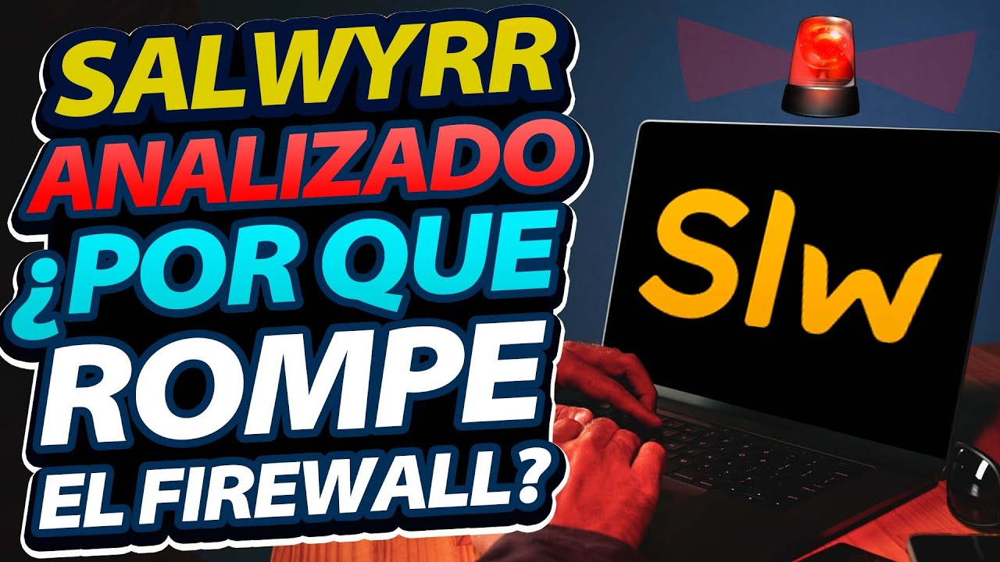

> 0:07 - 0:13 | "¿Quieres saber si este launcher es seguro o por lo contrario si lo debes eliminar ahora mismo de tu equipo?"

Pero...literalmente en el vídeo de los lanzadores dijiste que "*formatear es lo recomendado y como mínimo, si no podes o querés formatear, revisar la configuración del Firewall, desinstalar el launcher y pasar un buen Antivirus*". :c!

> 0:37 - 1:42

1\. Espero que las fotos de la casa sean totalmente falsas...pero me creería que el pibe no sabe que mostrar eso puede ser una muy mala idea. xd\
2\. Decir los componentes de su PC, especialmente siendo quien es, no es muy buena idea porque está todo para un ataque directo...aunque incluso para mi es un poco exagerado este punto sobre seguridad, el quien tiene acceso a todo es él (así que debería tener más cuidado).\
3\. "*Tiene colaboradores en Discord para moderar, lo típico, lo obvio*" Supongo que todos mayores de edad porque si no lo mencionarías como pasó con los impostores de LauncherFenix. a,a

> 2:07 - 2:54

Solo vengo a dejar los informes: [VirusTotal](https://www.virustotal.com/gui/file/413a460fae724b972ab9c52aeab029552245555c7df5b79eb2a6529e1dd7a090) y [Triage](https://tria.ge/230117-24ycrahg96) (no se usó ANY.RUN)

> 5:15 - 5:30 | "Te hago un paréntesis acá. Para todos los que yo entrevisto, a todos los que le pregunto, tienen la misma impresión de nosotros: los que molestan mucho son los de la comunidad hispana. Esto en la comunidad inglesa, francesa, etc. etc. no es tan importante"

¿En serio llegaste a entrevistar a otros no hispanohablantes? creí que el creador de Salwyrr era el primero. :P

> 6:42 - 7:28

Lo que dijo antes de esta marca de tiempo...¿Para qué opinar? creo que comenté mucho al respecto. xd\
Ahora sobre lo de Java: así se habla! xd también comenté al respecto antes, no va más la excusa de "*ayyy descargo Java desde la Deep Web porque o sea, digamos, digo, yo, o sea*" >:v!\
&nbsp; \* Pero puedo entenderle al pibe ya que empezó a los 14 y no es como que se vaya a volver un experto solo por hacer un lanzador. Aunque veo raro que le meta cosméticos para luego no saber analizar la API pública de Mojang, supongo que luego no tuvo ganas de cambiar el sistema porque se iba a romper todo.

> 7:44 - 5:55 | "Que no sabe por qué sucede"

Y se lo creo realmente, incluso si reportas el posible falso positivo no es como que te dicen "*pero pibe, en una parte de tu código llamas a matar a System32 ¿qué esperabas que pase?*" a,a

> 13:10 - 13:28 | "¿Qué hace Salwyrr? bueno, él tiene la tecnología para romper el muro. En vez de presentarse en la puerta y decir "hola, quiero pasar", él lo que hace es usar su "poder", su tecnología, para romper una parte de atrás del muro y acceder a tu equipo"

Pero si los comandos del `netsh.exe` existen hace como 20 años ¿Cómo que tecnología para romper el muro? ahsdgajsdgasda me causó gracia :v

Se que luego habla del motivo pero no voy a poner otra marca así que lo hago acá:\
Pibe, si nadie lo permitió/bloqueó antes, al usuario le va saltar el Firewall de Windows pidiéndote que permitas a Java, o sea >:v!\
Te entiendo que lo hagas por comodidad del usuario, pero ahórrate problemas y hace un vídeo súper simple de como eliminar los Java del Firewall de Windows así luego el usuario acepta uno por uno cuando toque.\
&nbsp; \* Me imagino que un Java será para Salwyrr y luego vendrán los Java cuando vayas a Multijugador / Abrir mundo en LAN dentro del juego, todo lo esperado.

> 16:23 - 16:26 | "¿Por qué Salwyrr accede a System32?"

Porque alguien tuvo la brillante idea de instalar Java durante el análisis...y obviamente no fue Salwyrr el de la idea.

> <Fin del vídeo>

Me encantó como inicialmente Salwyrr es hecho por una persona pero luego se empezó a mencionar en plural xd tipo como que no está solo y hay un equipo.\
Fuera de eso y las cosas que mencioné anteriormente...nada más que comentar.\
¿Recomiendo Salwyrr? pues es obvio que no ya que no descarga Java de un servidor oficial y que me usen `netsh.exe` de gratis tampoco me hace mucha gracia. De igual modo no lo probé ni nada así que...solo esos 2 son mis motivos para decir que no.
