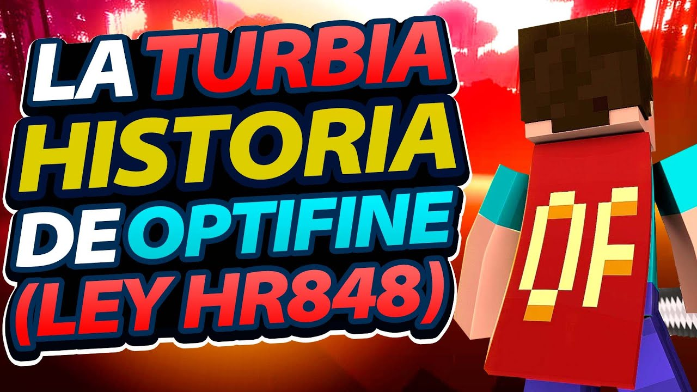

> 1:25 - 1:33 | "El creador de OptiFine es sp614x, este es su nick. Su nombre real entiendo que no es necesario darlo."

Porque no lo encontraste, picarón. (?

> 2:20 - 2:27 | "Pero antes, los enlaces que utilizaba para la descarga de sus trabajos, estaban enlazados con páginas raras."

Obviando la parte de que se le podría preguntar a sp614x personalmente, estoy seguro que no es algo que este a su alcance.\
Ya que los cortadores de enlaces tienen anuncios...no es como que vos podes decidir mucho sobre el tipo de anuncio.\
&nbsp; \* Y no, no necesariamente se verifican los mismos (ni Google se salva de anuncios con regalitos).

> 6:49 - 6:55 | "Resulta que, sp, el creador de OptiFine, también es el creador de un launcher pirata"

Pero si Magic Launcher era, es y posiblemente seguirá siendo un lanzador Premium ¿De qué piratería estás hablando? . _ .\
Si fuera pirata, lo hubieran eliminado de Minecraft Forum como le eliminaron versiones de OptiFine porque justamente contenía archivos del juego (o código copiado del juego).

> 7:04 - 7:13 | "Pero esto es así, sp pirateaba Minecraft y lo distribuía. Pero como es una acusación de peso, antes de continuar, demos pruebas."

Oh si, eso es fácil: entras a [OptiFine](https://optifine.net/) -> Minecraft Forums -> [Listo](src/img/OptiFine-Magic-Launcher.gif), literalmente el mismo tema de OptiFine te da link a Magic Launcher.\
Fin de las pruebas, su señoría. (?

> 9:13 - 9:20 | "(...) pero esto es algo que solamente sp lo sabría (...)"

Sinceramente, le podrías haber ido a preguntar tranquilamente.\
Hasta la parte de la piratería seguro que te dirá en donde si fue piratería y donde ya no. a,a

> <Fin del vídeo>

No tengo nada que agregar ni tampoco hay enlaces o algo.\
Solo una pregunta porque no se habló en ningún lado y aparece en la miniatura: ¿Qué tiene que ver la Ley HR848? xd
