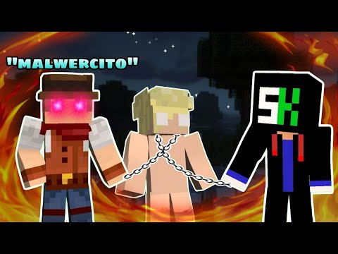

> 0:00 - 0:05 | "Puedes conocer a alguien mejor por los enemigos que ha hecho que por los amigos que tiene."\
> \- Jordan Peterson

"Lo relevante en la mentira no es nunca su contenido, sino la finalidad del mentiroso."\
\- Jacques Derrida

> 0:07 - 0:37 | "Hace como 3 semanas aproximadamente expusimos a la red SK, un grupo de individuos que a lo largo de muchos años han generado para la comunidad una aplicación insegura.\
> Desde sus orígenes podemos ver cómo le pedían a los usuarios que apaguen el antivirus para que ellos puedan usar la aplicación.\
> O cómo en la actualidad diferentes empresas antivirus dice que tiene malware.\
> O cómo Triage marca el proceso sospechoso que mencionamos en el video original.\
> SK tiene todas las alertas y patrones de una aplicación insegura, de hecho es la más insegura de la comunidad de Minecraft (ni TLauncher se atrevió a tanto)."

1\. Más tirando para 5 semanas. :v\
2\. ¿Así que en realidad los roles forman la red y no el número de devs? al final si mentiste xd pero bueno, para este vídeo seguía pensando que es el número de devs.\
3\. Si...como que de estos mensajes: [#1](https://discord.com/channels/141669825129873409/300688469460516864/333206137430212608) (el cual ya contesté antes), [#2](https://discord.com/channels/141669825129873409/300688469460516864/1011708787016605827) (el cual tiene 1 mes en el servidor, aún no era moderador ni nada), [#3](https://discord.com/channels/141669825129873409/290149381548670976/1003001090566013101) (un usuario con 4 meses para este mensaje y que recibió el rol de traductor en Enero del 2023), [#4](https://discord.com/channels/141669825129873409/504240965968723998/1083696209220354090), [#5](https://discord.com/channels/141669825129873409/290149381548670976/1057062332167102544), [#6](https://discord.com/channels/141669825129873409/290149381548670976/1098278048173936660) y [#7](https://discord.com/channels/141669825129873409/290149381548670976/990310179801276456). Solo el #3 habla sobre desactivar el Antivirus y el #7 directamente lo menciona porque así lo quiere Mojang.\
4\. Que lindas imágenes sacadas de tu canal de pruebas (ya puse link antes), lástima que ya son viejas porque estaban en 0 para cuando hiciste este vídeo (excepto la 3.png, ya que no es SKlauncher).\
5\. Sigo esperando el informe de Triage, aunque ya respondí un poco al respecto. Igualmente, si es como otros informes que vi, es hacia Java así que...de sospechoso no tendría nada.\
6\. Totalmente, porque el [BazarBackdoor](https://twitter.com/soymiguelgamer/status/1637243962682474497) (que justo estás buscando solamente por [family:bazarbackdoor](src/img/Triage-Family-BazarBackdoor.png) y solo 1 no ocurre solamente en Windows 7) que te encajaron durante X versiones es 100 mil veces menos agresivo que todo lo que se le acusa a SKlauncher... . _ .

> 0:47 - 1:01 | "Por privado y en público como 5 veces y hasta lo puse en Twitter, te lo muestro, invité a SKmedix, el líder de la red SK y dueño de SKlauncher, a un debate a que venga y que nos diga a todos que miento y las pruebas de lo que digo es falso."

¿Eh? ¿Por privado a quien? si SKmedix, Foxer, x13 e index no tienen historial de conversación con vos (hasta les pedí captura). . _ .\
Pero bueno, como que te respondí a esto antes (donde justamente doy link al Tweet).\
&nbsp; \* Donde, pese a que 2 usuarios mencionan el directo, nadie menciona nada sobre la invitación...así que muy avisado no estaba SKmedix xd

> 1:02 - 2:07 | "Imagínate si fuera una persona de bien, viene un vídeo mío, el cual también puede grabar y subir donde quiera, y dice: esto es mentira por esto.\
> \- Tomá, acá está la prueba de que nosotros jamás le pedimos a los usuarios que apaguen los antivirus.\
> \- Tomá, acá tengo un informe donde Triage no dice lo que dijiste en el video.\
> \- Que diga que él no tiene un negocio ilegal y que muestra la prueba y el permiso de Microsoft donde lo dejan distribuir Minecraft.\
> \- Que diga que no vulnera la seguridad de los niños que juegan a Minecraft y nos dé las pruebas y las explicaciones.\
> Pero no hizo eso, se escondió ¿Y por qué lo hizo? porque no puede desmentir la verdad, más cuando es tan clara y evidente. Y como no pudo hacer esto salió a mentir él con su grupo y nuevos aliados, los cuales expondremos en este vídeo.\
> Me han insultado, atacado, difamado, y eso es habitual, se ha metido directamente con la comunidad de este canal llamándolos de todo, desde que no tienen cerebro hasta que somos todo acá niños de 10 años que conformamos juntos una comunidad tóxica. Pero sobre todo salieron a engañar aún más niños con una serie de mentiras orquestadas y planificadas, que cuando ahora te las enseñe sencillamente te dará asco, no podrás creer que alguien mientras así."

1\. Pero que maravillosa jugada...vamos a poner, si no hubiera bastado antes, aún más la idea de que SKmedix no es una persona de bien, que en SK están organizados, son una red, blablabla. xd\
2\. Sabes bien que no va a hacer eso porque no tiene ni idea de todo lo que has dicho xd Aún no vio este repositorio ni le conté todo, pero cuando le pregunté "¿Tendrías una entrevista con Miguel?" me dijo que podría pero en un formato especifico y todo porque no quiere que luego no se vea lo que él respondió y eso.\
&nbsp; \* Exacto, está dispuesto a hablar con la persona que lo acusó de cosas re fuertes y le mintió en toda la cara diciendo que iba a poner el testimonio/versión de los hechos de SK...cagate de risa. xd\
&nbsp; \* Y otra cosa, SKlauncher no distribuye Minecraft ya que sale todo del servidor de Mojang.\
3\. ¿Eh? ¿Los de SK diciendo algo contra tu comunidad? te la dejo, ni pienso buscarlo...pero recordá algo: vos literalmente trataste a TODO EL SERVIDOR de personas de mala fe, que defienden el malware, etc...ni siquiera a los que tienen rol, metiste a todo el maldito servidor. Así que no se...medio obvio que se van a meter con vos y tu comunidad si vos y tu comunidad hacen lo mismo. -.-"

> 2:25 - 4:07 | "Mentira N-1\
> Prepárense porque se van a reír. SK dice que yo los recomendaba a ellos, repito, que yo les hice un vídeo a ustedes recomendando SKlauncher.\
> Increíble, no sé cómo se puede mentir tanto y esto empezó así: Un día Discord me avisa que un usuario fue muteado por hacer spam. Mirá, te lo muestro.\
> Esa persona es un moderador del servidor SK y un desarrollador de SKlauncher, ojo eh! Y en todos lados ponía este enlace, esto mismo que vas a ver ahora, Malwercito, más adelante te lo presentaré, lo usó para hacer un vídeo y mentirles a ustedes diciendo que yo también recomiendo SKlauncher porque le muestra esto: Debemos decir que por el momento es el más bueno que se subió a este escáner.\
> Pero eso es un recorte de un video, en el cual lo que yo dije en realidad es esto: Aunque no recomendamos en este canal SKlauncher, debemos decir que por el momento es el más bueno que se subió a este escáner (de momento).\
> Te mintieron, dije que no recomendaba SKlauncher y dije que es el más seguro de lo que se subió el escáner de momento.\
> (...)\
> Recortaron un clip y le dicen a todos que yo recomendé a SKlauncher en este canal, no se puede creer el nivel de mentira que tiene esta gente.\
> Como pueden ver aquí está expuesto el moderador y desarrollador mintiendo (...)"

1\. Index es solamente moderador, nunca fue desarrollador de SKlauncher... . _ .\
2\. En el servidor de Discord de SKlauncher, todos los que pusieron enlace a ese vídeo (el que analizás los lanzadores) y mencionan un minuto en especifico pues...son solo dos personas: un random e Index ¿Pero qué dicen?\
&nbsp; \- [Index](https://discord.com/channels/141669825129873409/1104466588939337829/1120084137945079838): Sacando la parte que dice "nos elogiaba" (porque, si bien es verdad que terminó siendo el mejor junto con LauncherFenix, no es como que elogiaba a nadie), podemos ver que se está quejando de Triage con el WriteProcessMemory (ya que Miguel dice que todo bien ¿pero ahora es sospechoso?) y con ANY.RUN (ya que Miguel dice que es normal que verifique y toque Java ¿pero ahora es sospechoso que justamente el WriteProcessMemory de Triage toque Java?).\
&nbsp; \- [Random](https://discord.com/channels/141669825129873409/1104466588939337829/1120091825944940595): Bueno...lo que dije para Index resumidamente. xd\
Luego sobre Malwercito (EJota10) pues...como que en su vídeo, la primera vez que muestra el fragmento, lo hace desde la parte de ANY.RUN y luego ya repite lo último 2 veces (solo se saltea la parte de que NO recomendamos SKlauncher en esas 2 repeticiones). Pero claro...lo que vos decís que recortaron, lo terminaste recortando vos aún más. . _ .

3\. Literalmente en un directo (asumo que en el anterior a este vídeo) recuerdo que dijiste algo como "yo creo que, como no saben Español, no se dieron cuenta que está recortado".\
4\. ¿Hizo spam en serio? me encantaría verlo así le digo que no vuelva hacer estupideces. xd

> [!NOTE]
> El [clip](https://www.youtube.com/clip/UgkxFmb7Kk9G-AlVlQ6HOe0MGLDkA) que muestra en el vídeo está eliminado, pero en el servidor de Discord de SKlauncher (Index) compartió ese mismo día [este](https://www.youtube.com/clip/UgkxFmb7Kk9G-AIVIQ6HOe0MGLDkAK-dyH8d) (si, la URL es diferente, lo se).\
> Confiaré que realmente no son el mismo clip, que uno (el del vídeo) es más o menos lo que muestra EJota10 y el otro responde a un punto diferente (el punto 2 que mencioné arriba) ya que no hay registro alguno de ese clip/enlace exacto en SKlauncher.

> 4:07 - 6:13 | "Mentira N-2\
> Dicen que miento en los términos y condiciones porque esto siempre estuvieron en inglés y nunca en español y encima dicen que en inglés dice otra cosa.\
> Esto la verdad me indigna, en su página vimos que los términos de uso de SKlauncher dicen: (...).\
> Pero en teoría esto nunca estuvo en español y como podes ver acá, a los 10 minutos de subir el vídeo, borraron la sección en español del sitio web y dejaron solo la versión en inglés (siempre refiriéndome a los términos de uso) y salieron a decir que jamás estuvo en español, que yo me lo inventaba.\
> Esto ya lo desmentí en un directo donde a la vista de todos abro mi navegador y muestro el historial y te expongo las URLs del sitio la semana anterior al vídeo donde estaba en español y ahora dice que esas páginas fueron borradas.\
> Literalmente borraron las pruebas pero es que encima esto no es relevante, no sé qué piensan estas personas de nosotros la comunidad de habla hispana porque nos mienten en la cara diciendo que en inglés dice algo distinto que en español, creen de forma no irónica (quizás) que no podemos leer el inglés. Nos tienen como un grupo de infraseres ignorantes, creen que al ponerlo en inglés nosotros no lo podemos leer al parecer ¿y sabes que sí podemos? y miren, dice lo mismo: (...).\
> Dice exactamente lo mismo pero recuerda que sí estaba en español y que lo borraron a los 10 minutos de subir el video, SK vuelve a mentir y borra su accionar, acá tenés las pruebas."

1\. Nah, ya te mostré lo que pasó realmente...pero gracias por mostrar en el vídeo tu historial, podemos ver que el 13/06/2023 entraste a las páginas (todo lo demás, ya lo expliqué cuando mencioné el Tweet).\
2\. Si que es relevante, ya que los acusas de eliminar pruebas y de mentir con que no estuvieron en Español. :P\
3\. No, no dicen lo mismo...pero bueno, como que estamos peleando contra lo que vos interpretas en vez de la traducción xd ya respondí a todo el tema de los términos y condiciones en la parte de tu vídeo.

> 6:13 - 10:24 | "Mentira N-3\
> Los falsos positivos existen porque Minecraft original tiene uno.\
> Prestame atención porque esta mentira está muy bien armada, es la típica artimaña con la cual caen los niños de la comunidad de Minecraft. Necesito que la entiendas, así cuando ves a un niño le muestras la verdad. Me tomaré todo el tiempo para explicar bien esto.\
> Un usuario de SKlauncher que me insulta todo el tiempo y además usa esto como insulto \<Resalta el Gey del Geymur>, increíble. Rebuscando muchísimo encontró que una versión alternativa de Minecraft, un solo antivirus le marca que tiene un malware. Entonces te dicen: mirá, los falsos positivos existen. Por ende, todos los informes que muestra Miguel donde hablan del malware que tiene SK son falsos porque todo siempre es un falso positivo.\
> Pero eso es una mentira bien pensada, pero es una mentira. Te la desmiento fácilmente: ¿Los falsos positivos existen? claro que existen, pero que exista el falso positivo no quiere decir que siempre que un antivirus hable sea un falso positivo. Tan solo decirle eso a la gente es una clara mentira y exageración, repito: que exista el falso positivo no quiere decir que todo lo que dijo un antivirus sea mentira y no tenemos que leerlos nunca.\
> Hablemos abiertamente del tema, todos los antivirus son revisados de forma diaria por múltiples empresas y desde tu Sistema Operativo hasta organizaciones independientes verifican exactamente eso: los falsos positivos de los antivirus.\
> Por ejemplo existe AV-TEST y AV-Comparatives como organizaciones independientes que analizan los antivirus, esto no te lo dijeron ¿verdad?\
> Veamos a AV-TEST, como puedes ver la puntuación más alta es un 6, el mismo que tiene por ejemplo Kaspersky, F-Scure y MalwareBytes. Te hablo de antivirus que detectaron malware en SK, no te hablo de cualquiera.\
> Pero hablemos a favor de SK ¿puede ser que si agarrás un informe de una versión de este lanzador en algún momento de la historia tenga un falso positivo? ¿puede ser que SK se haya comido en su historial alguna alerta falsa?\
> Obviamente que sí, algún falso positivo se comió. Pero nadie salió con un solo informe, con una sola alerta, como hacen ellos con el Minecraft original, se enseñó múltiples informes a lo largo de años donde diferentes empresas y muchas de ellas de la más respetada de la industria detectan malware, se enseñó la experiencia de los usuarios desde hace años atrás hasta ahora, donde decían muchos que esto tiene malware: <Acá empieza a mostrar capturas de los chats con algunas traducciones, terminando con que quedan más de 60 conversaciones aún sin subir>.\
> Se enseñó que ellos te pedían que apagues el antivirus para que se pueda instalar SK en tu computadora: <Acá muestra los 7 mensajes de antes>.\
> Nadie los acusa con una sola alerta, se muestran muchos informes, muchas alertas, que quedaron firmes luego de que ellos borren los falsos positivos, porque con un informe sale por primera vez, le marca como 10 alertas, ellos le borra los falsos positivos y luego quedan solamente las alertas firmes y de eso hablamos, SK miente y aquí te lo demuestro."

1\. Solo te insultó 2 veces antes de que publiques este vídeo...y eso porque estoy contando "intento de manipulación" como insulto. . _ .\
2\. Te diría que la fonética de "Gamer" es "Geimur" (y mira que existe la palabra Gaymer), más que usarlo como insulto lo hace para molestarte. Igualmente le pregunté tomándolo como insulto, pero no me respondió ya que el usuario lleva inactivo desde inicio del 2024.\
3\. Es la versión ofrecida a la comunidad desde la página, tu tema de que es alternativa o no solo te importa a vos, es lo que se le da a la gente. Segundo se detecta comportamiento de malware por un antivirus, eso no es un error, no me des tus pareces, tenes información te escucho y coso (? Si, te estoy jodiendo usando lo que dijiste en el servidor de Discord de SKlauncher. xd\
4\. [Link al mensaje](https://discord.com/channels/141669825129873409/1104466588939337829/1120051150398435328) donde literalmente debajo le responde un moderador, arruinando toda esa mentira tan bien pensada que dicen según vos. xd\
5\. Muy lindo lo que hablás sobre [AV-TEST](https://www.av-test.org/es/) y [AV-Comparatives](https://www.av-comparatives.org/), te agradezco de verdad que hayas recortado todo así no puedo ir a verificar cual de todas las pruebas revisaste (ya que no hay ninguna donde los 3 Antivirus coincidan en números bajo el mismo mes donde se probó).\
6\. Si...como que a SKlauncher le puedo revisar todo mientras que a Minecraft Launcher no...pero bueno, ya respondí a todos esos "informes de usuario" y demás.\
Ahora quedaron firmes con 0 alertas ¿Sabes quien sigue firme con una alerta? [Minecraft Launcher](src/img/Minecraft-Launcher-Virus.png) (no te voy a contar el que es Instalador, que también te mostré que tuvo 1 alerta...pero si querés lo hago: ¿2 es un numero suficiente? ¿O eso se lo aplicás a todo lo que no sea Minecraft Launcher? xD)...entonces, bajo TU MISMA LÓGICA significa que Minecraft Launcher tiene virus (un troyano para ser exacto).\
¿Ves qué no tiene ni puto sentido? Eso es lo que dice el Geymur, hasta lo dice luego de unos mensajes...hasta vos mismo te quejabas que no comparan con el Minecraft Launcher pero ahora que lo hacen, vas y te quejas igual o sea no no no, un poquitito de consistencia te pido Miguel...un poquito nada más.\
PD: SKlauncher no borra nada, solamente informa del posible falso positivo y la empresa es quien borra (o no) la alerta.

7\. ¿Nuevas fotos del chat? bueno, solo responderé a los que no aparecieron antes (no acepto duplicados):\
\- [#2](https://discord.com/channels/141669825129873409/141669825129873409/347297457194926080): Sacando tu mala traducción, me fui a ver los logs porque estaba entre dos opciones: es un chiste o le está respondiendo a alguien que borró su mensaje. Luego de revisar los logs, resulta que es lo primero: es un chiste...Windows Defender te está detectando a VOS (persona) como virus. . _ .\
\- [#8](https://discord.com/channels/141669825129873409/290149381548670976/702281037517946991): Considerando su historial de mensajes, además de no saber Inglés, está preguntando si tiene virus...pero bueno, también lo puede decir por la foto encima de él, ya que empieza con un "Due to recent virus-related events" (COVID-19, ya mencioné esto antes). No sabemos absolutamente nada de él, no sabemos si fue SmartScreen, Windows Defender, otro AV, el Firewall, etc. Pero hey...luego en este vídeo Miguel se va a quejar de los randoms, pero para atacar a SK no le importa nada. :v\
\- [#14](https://discord.com/channels/141669825129873409/290149381548670976/919479775372935168): Nuevamente, no sabemos si fue SmartScreen, Windows Defender, otro AV, el Firewall, etc. Si los mensajes que siguen están en lo correcto, entonces es SmartScreen (no Windows Defender) y bueno...no me hagan repetir de nuevo todo. xd\
\- [#20](https://discord.com/channels/141669825129873409/290149381548670976/423833219176202250): Ya que el usuario dice que no tiene Norton, entonces es cosa del ISP de que tenga Norton ConnectSafe (porque es usando sus DNS). No es sobre SKlauncher en si, es sobre el subdominio y hasta el mismo mensaje te lo dice que puede ser peligroso (no que está 100% confirmado que es peligroso, malicioso, malware, virus u otra cosa).\
\- [#21](https://discord.com/channels/141669825129873409/290149381548670976/655126793820569641): Nuevamente, no sabemos si fue SmartScreen, Windows Defender, otro AV, el Firewall, etc.

8\. Ya respondí a esos 7 mensajes antes.\
9\. Falso, ya estaban firmes con 0 detecciones para este vídeo (sin contar los otros informes de VirusTotal que mostré).\
10\. Falso, una sola vez sucedió lo de tener 10 detecciones (que no mostraste, pese haber asegurado de tener todo grabado y no se que).\
11\. Si SK miente, miente, miente, miente y sigue mintiendo...¿Por qué vos tenes la necesidad de cambiar palabras, recortar y mal interpretar cosas, ignorar si X usuario tenía rol en tal momento, usar capturas viejas, etc.? . _ .

> 10:24 - 12:49 | "Pero hagamos una pausa porque acá la cosa se pondrá fea, así que voy a hacer un pedido a la comunidad de este canal antes de continuar: por favor, nadie quiera defenderme de lo que les voy a enseñar ahora. Como ven, sé hacerlo bien y solo, no quiero que nadie haga nada, ni siquiera un comentario en ningún sitio por lo que van a ver ahora.\
> SK salió a atacarme de diferentes maneras y una fue orquestando un vídeo, y encontraron un pequeño creador de contenido con un plan (...)\
> (...) Imagínate la falta de dignidad que por visitas trata de engañar niños para que vuelven a instalar TLauncher, que fue descubierto y comprobado que quería robar los accesos de sus redes sociales y las cuentas bancarias de sus padres (...)\
> (...) Este personaje tiene un plan (...)"

1\. Eso explica que justo con este vídeo no hubo casi ataque en el servidor de Discord de SKlauncher. :v\
2\. ¿Te das cuenta que acabas de decir que EJota10 es quien tiene el plan? . _ .\
3\. ¿Comprobado que TLauncher hacia eso? Mmm...ojito Miguel, que recién en el vídeo analizando varios lanzadores dijiste que SE COMPROBÓ Y DEMOSTRÓ algo...todo lo demás, siempre se mantuvo como posibilidad. -.-"\
4\. Ah pos si, realmente estás diciendo que EJota10 es quien tiene el plan. xd

> 12:50 - 18:18 | \<El Plan>\
> "Se puede ver como este moderador llamado x13 (el amigo de Malwercito) y diferentes usuarios que ayudan en la red SK hablan directamente con Malwercito en el Discord de SK. Charlas directas, te enseño tal cosa, etc. etc.\
> Ya anteriormente SKmedix le dijo que decir y cómo defenderlo de todos los informes negativos que tiene SK en una "entrevista". Ah, para esto sí la entrevista, ahí sí sale de la alcantarilla, bueno ok.\
> (...) Vos imaginate estar en un Discord y que te recomienden 50 veces el mismo vídeo, que te hagan 50 veces spam de lo mismo. Es tan descarado que hasta lo automatizaron ahora, vos ponés (no sé) virus Miguel y te aparece un bot poniéndote en la cara el vídeo (...)\
> \<Acá muestra un Tweet de alguien atacando a Miguel>\
> (...) Charlas con la red públicas, spam en Discord, los usuarios reunidos haciendo fuerza en el vídeo, previamente ya hacían vídeos recomendando SK donde dicen tener charlas con el desarrollador por privado, pero todo esto debe ser casualidad. El vídeo está lleno de mentiras, pero vamos a responder a todas (las más relevantes) y hacer quedar como lo que son a estas personas: mentirosos. Comencemos."

1\. x13 no es amigo de EJota10, ni un solo mensaje privado tienen entre ambos y el historial de mensajes público tampoco sugiere que podrían serlo.\
2\. Lo que decís no se asemeja para nada a lo que mostrás...mucho menos si me pongo a leer el historial de mensajes. -.-" Ya hasta te metes con gente sin rol, es increíble esto...\
3\. SKmedix y EJota10 no tienen mensajes entre las fechas que escribiste en el servidor de Discord de SKlauncher (09/06/2023) y el día que EJota10 subió su vídeo (18/06/2023 - Algo que EJota10 muestra en su 2do vídeo hacia vos).\
&nbsp; \* Obviamente me refiero a mensajes que puedan sugerir que están haciendo un plan y eso...porque obviamente el "que decir y cómo defenderlo" tampoco sucedió. xD\
4\. Te muestra [esto](src/img/SKlauncher-01.png) (algunas veces con la miniatura del vídeo) si alguien dice "tiene virus" gracias a todo el ataque que hizo tu comunidad (que seguro dirás que no es tu comunidad) sumado a todo el pánico que se creó.\
5\. Sobre esos ataques en Twitter/Directo pos...ya los respondí (lo mismo sobre tu "nunca dije algo malo de SK")...bah, justo este Tweet que mostrás no se podía ver así que lo hago ahora: literalmente el que más está atacando, sos vos Miguel...y tampoco cumpliste con mostrar lo que hace. . _ .\
6\. Obviamente, todo está organizado y todos mienten excepto vos y tu comunidad ya que son superiores en todo. a,a

> [!CAUTION]
> Dejaré todas las marcas de tiempo pero responderé a cosas especificas porque...bueno...¿Qué pinta SKlauncher en un Miguel vs EJota10 (Malwercito)? xd\
> Tampoco pienso repetir las cosas, así que si veo que se dice algo que ya respondí antes...lo ignoro.

> 18:19 - 21:28 | "Mentira N-4"\
> EJota10: "Miguel habla mal de SK porque son polacos y él xenófobo".\
> "Esto no solo lo dicen de forma literal (...).\
> (...) ¿Pero saben quién es xenófobo? tu amigo, el que te dio el material para este vídeo, el moderador x13. Miremos su perfil de Discord: insulto a Putin, a la bandera rusa y los holandeses son piratas. (...) Y claramente es un odio desmedido al pueblo ruso, qué loco es que el que te acusa de xenofobia sea el amigo del xenófobo. (...)\
> (...) Si vos crees que si yo hago esto estoy mal y que este usuario al hacer esto está bien: felicidades, sos fanático de un lanzador pirata de Minecraft. Yo te animaría que te busques un fanatismo honesto. (...)"

1\. EJota10 no dijo eso de forma literal, ni tampoco veo que alguien en el Discord de SKlauncher dijera una locura así.\
2\. x13 no le dio nada ni son amigos, ya lo mencioné antes.\
3\. Respecto al "Sobre mi" del perfil de Discord de x13, lo 1ro es claramente un "Que te jodan Putin", ni más ni menos...no Putin y Rusia. Lo 2do lo sacarías si hubieras [preguntado por la nacionalidad de x13](https://discord.com/channels/141669825129873409/504240965968723998/1120077035008700507), así que...vamos a pedirle a x13 que nos explique el "Sobre mi" que tiene en su perfil de Discord:\
&nbsp; \- Es algo que puse en 2022, soy una persona y puedo hacer lo que quiera (es como preguntarle a alguien de los años 40 qué significa poner "Que te jodan Hitler" en su estado de Discord).\
&nbsp; \- Un ruso me ha pedido una aclaración ya que no estaba claro que :bald_man: fuera Putin, así que he añadido el nombre. No importa de qué lado estés en esta guerra, está claro que la población civil de ambos bandos sufre.\
&nbsp; \- Es mi país y la segunda bandera digamos que "Spacewar" es mi juego de Steam más jugado.\
A mi me encantaría saber qué interpretó Miguel con [el avatar de x13](src/img/x13-Discord-Profile.png) ¿Acaso pensó que está diciendo "Los ucranianos son piratas"? . _ .

4\. No tirés esa de "qué loco es que el que te acusa de xenofobia sea el amigo del xenófobo" ya que vas a lograr que te relacionen con LixaH.\
&nbsp; \* No me hagas explicar esto, bastante cosas negativas te pueden decir como para sumarte algo tan grave.\
5\. Más que fanatismo es que tenes un serio problema con x13...pero bueno, vos mismo lo dijiste que toda esta investigación se hizo más fuerte porque te molestaste con él.\
PD: No animes a que alguien busque un fanatismo honesto, literalmente el fanatismo es el apasionamiento y tenacidad desmedida en la defensa de creencias u opiniones...literalmente te quejás de esto pero vas y animás a que igualmente lo hagan. xd

> 21:29 - 22:09 | "Mentira N-5"\
> EJota10: "No sé si es verdad que te dicen los de SK que apagues el antivirus y si lo hace no es malo porque los antivirus se equivocan"\
> "No sólo es cierto como lo vimos en el minuto 8:30, sino que además decir que es recomendable y que no pasa nada por apagar el antivirus es de una irresponsabilidad enorme, es tan malo que uno del propio staff de SK dice que no está de acuerdo con esto: acá lo puedes ver \<Mensaje mio donde digo que no deberías apagar el AV>, lo contradicen lo mismo de SK, es increíble. (...)"

1\. Ya respondí al respecto antes.\
2\. [Link al mensaje](https://discord.com/channels/141669825129873409/504240965968723998/1120077871000596591) donde dije eso (obviamente lo ideal sería excluir lo justo y necesario, no apagar todo).\
3\. No soy parte del staff de SKlauncher...pero gracias por mostrar vos mismo como todo eso de red polaca organizada y blablabla no existe. a,a

> 22:09 - 23:17 | \<Mentira N-6>

> 23:18 - 26:40 | "Mentira N-7\
> \<Acá EJota10 más o menos dice que todas las detecciones de SKlauncher son por Launch4j>\
> (...) ¿Qué es Launch4j? porque claramente no lo sabe ni Malwercito ni los usuarios que defienden la red SK. Launch4j es una herramienta de código abierto que permite convertir aplicaciones de Java en archivos ejecutables de Windows (un .exe), permite empaquetar y configurar la aplicación Java junto con su entorno de ejecución para que pueda ser distribuida y ejecutada en sistema de Windows sin necesidad de tener instalado en la PC una Máquina Virtual de Java. (...)\
> ¿Esta aplicación es conocida por ser malísima y estar llena de falsos positivos? (...)"

1\. Ya le marqué eso a EJota10 en su vídeo.\
2\. Ni tampoco lo sabe Miguel Gamer...literalmente necesitas Java para iniciar un .exe generado por Launch4j.\
3\. Si, literalmente [lo dice el mismo Launch4j](../Vid-11/src/img/Launch4j-Example.jpg). (?

> 26:40 - 28:43 | "Mentira N-8\
> (...) Vamos a sacar el diccionario, hasta el idioma español debo enseñarles. Una palabra tiene varios significados según en el contexto que se use (...) en este caso: impugnar, refutar o contradecir. Literalmente, el hecho de contactar con una empresa dueña de un antivirus y decirle que quiten una alerta, se le llama impugnación. (...)\
> ¿Se podría engañar por email a una empresa antivirus con una impugnación bien estructurada? la respuesta es sí, ya ha pasado en la historia más de una vez. (...)"

1\. El término "[atacar](https://www.rae.es/drae2001/atacar)" generalmente implica un acto agresivo o perjudicial hacia algo o alguien. En este contexto, "atacar" podría implicar intentar sabotear o dañar deliberadamente los informes de VirusTotal.\
2\. Oh, que genial! Vamos a poner una nueva idea (negativa, obviamente) sobre SK :v! Pero bueno, ya mostré los correos completos antes.

> 28:48 - 29:43 | "Mentira N-9\
> (...) Un mensaje de hace 5 años de un random que no sabemos que hacía. (...)"

Wau...antes no importaban las fechas, tampoco si era o no un random y mucho menos si daba información.

> 29:44 - 30:32 | \<Mentira N-10>

> 30:32 - 31:48 | \<Mentira N-11>

> 31:49 - 33:03 | "Mentira N-12\
> (...) No es lo mismo un trabajo honesto que uno que no lo es. Por ejemplo hay desarrolladores de aplicaciones que estudian programación y siguen sus sueños y trabajan para una empresa (...) Pero hay desarrolladores que tienen trabajos deshonestos, la piratería es deshonesta (...) la piratería es robar (...)"

Bueno...justo ATVI venía de algo totalmente negativo como para que lo pongas como ejemplo de algo positivo xd\
Pero ya que la piratería es robar...¿por qué solo a SKlauncher te pusiste a leer las leyes de su país?\
O peor aún ¿por qué estás a favor de la piratería si es como conservación? O peor aún! En vez de ocultarlo, hasta vos mismo decís como pirateabas a dos manos. . _ .\
&nbsp; \* Encima vos tratas a todos de piratas, hasta un lanzador PREMIUM...bajo esa lógica horrible, hasta los creadores de Mod Loaders son piratas (ok, al menos Forge MDK porque no probé el resto).

> [!NOTE]
> Lo de piratería como conservación y que antes pirateaba a dos manos, es algo que recuerdo de Miguel en algunos directos (no es algo que dijo en este vídeo).\
> No recuerdo si fueron directos pasados o futuros.

No te digo que defiendas la piratería, seguí incentivando el apoyo a los creadores que eso está genial. a,a\
Pero para hablar de los demás, la piratería es súper negativa pero para hablar de vos ya no es tan negativa...en cuanto a palabras utilizadas, obviamente.\
&nbsp; \* Sin mencionar la desproporcionalidad...no podemos meter a SKmedix en la misma bolsa que, por ejemplo, CODEX.

> 33:04 - 33:53 | "Mentira N-13\
> (...) No, no se oculta, la prueba está en que sale hasta en el propio video. Ocultar y modificar las cosas es lo que hacen los ayudantes de SK, recortando fechas o mi propio video para engañar a la gente.\
> Yo no nombro los puntos de vista de los usuarios porque acá estamos hablando de informes y de datos sólidos (...)\
> Lo que opinamos todos es irrelevante a la hora de hablar de una prueba (...)"

1\. Ya respondí a eso y EJota10 no dijo eso.\
2\. Nah, no metas a SK en algo que hizo EJota10 (que ni siquiera es tal cual vos decís, pero bueno).\
3\. Ay si, datos sólidos! claro jajaja\
4\. Si que es relevante, solo si es contra SK :v Por eso comentás la opinión de SK (decir que no es un virus) e ignorás la del usuario (decir que está seguro que es un falso positivo).\
&nbsp; \* Digo, ninguno de los dos dio pruebas ni nada...así que es solo la opinión...bueno, como que lo de que no esté firmado es un dato sólido ¿no?

> 33:54 - 34:38 | \<Mentira N-14>

> 34:39 - 37:29 | "Mentira N-15\
> (...) Según la lógica de SK (...)\
> Los de TLauncher nunca hablaron conmigo y se comieron varios videos. (...)\
> Si un desarrollador de un lanzador habla conmigo, yo le prometo que al lado de lo que yo descubro (que esté mal o supuestamente sé algo malo) tendrá al lado la respuesta del desarrollador, dándote su versión de los hechos para que las personas elijan en qué creer. (...)\
> Otro beneficio al que puedo acceder, es no revelar datos sensibles y personales a cambio que aporte más datos que sean relevantes para la comunidad de Minecraft (porque acá no somos un canal de chimentos) (...)\
> ¿Y por qué no le creemos al que hizo la aplicación acusada de malware cuando él dice que no le puso malware? porque así no se investiga, su comentario es solo un testimonio con interés. ¿Cuál es el interés de SK? ¿Por qué mentiría? Pues, él tiene el peligro de dejar de recibir dinero. (...)\
> Me imagino la charla:\
> &nbsp; \- Miguel: ¿Le metiste un virus al lanzador?\
> &nbsp; \- SKmedix: Sí, sí lo hice. Antes no lo dije porque nadie me había preguntado, pero...ahora que alguien lo hace por primera vez: sí, sí lo hice y lo admito. Y perderé a partir de ahora el dinero de mi aplicación pirata. (...)"

1\. Según la lógica de EJota10.\
2\. O sea...los acusaste de cosas increíblemente fuertes y nunca fuiste a hablar con ellos...esperaste que ellos te hablen a vos...quiero creer que me equivoco y que realmente intentaste contactarles y no hubo caso. . _ .\
3\. Eso no pasó con SKmedix, literalmente solo mostraste una cosa y fue para usarlo en su contra.\
4\. ¿Elegir en qué creer? ¿Es una broma? ¿Acaso debo elegir creer que SKlauncher espiaba a los usuarios cuando en realidad no lo hizo? -.-"\
5\. Ah sos un amor...el que tanto oculta su información privada, es capaz de violar la privacidad de los demás.\
6\. ¿Recibir dinero? Si literalmente SKlauncher es más pérdida que beneficio, aún sigo esperando (incluso en 2024) que tengan algo que no sea Google Ads. >:v!\
7\. JADHJSGASDJHGASDJHAS muy bueno, ese punto te lo doy porque hasta yo escribo en el servidor de Discord de SKlauncher algo como "¿Le vas a preguntar al creador del virus si su virus tiene virus?" a,a

> 37:29 - 39:46 | "Mentira N-16\
> (...) Si tienen algo de dignidad, luego de esto saldrán y dirán que se equivocan. Dudo que lo hagan, pero les daré el beneficio de la duda porque literalmente me retan a decir que probemos otra aplicación con Launch4j donde aparece seguro malware.\
> Pero para hacerlo bien transparente, porque luego dirán que yo manipulo el programa o algo así para que no se detecte algo etc. etc., vamos a buscar aplicaciones que todos los usuarios conozcan y no tengan ninguna relación conmigo para saber si es verdad que Launch4j todo lo que hace queda marcado como malware.\
> \<Acá muestra 3 programas que usan Launch4j y en VirusTotal no tienen alertas>\
> (...) Y sobre esto tengo una prueba más interesante en los comentarios, anda a verla."

1\. Literalmente SKmedix te iba a dar todo para que pruebes vos mismo en pasar SKlauncher por Launch4j.\
2\. Me encantaría saber de donde sacaste que están usando Launch4j...

|       **Nombre**       |     **Links**    | **Launch4j** | **Firmado** |
|:----------------------:|:----------------:|:------------:|:-----------:|
|      Sweet Home 3D     | [Web](https://sourceforge.net/projects/sweethome3d/) - [VirusTotal](https://www.virustotal.com/gui/file/c3e3096b8c942d94e9ac7f8ac058085aa2f731d77fd04a1e7d304d43ec70fe35) |      No      |      Si     |
| Universal Media Server | [Web](https://www.universalmediaserver.com/) - [VirusTotal](https://www.virustotal.com/gui/file/c96e1d8816505db593937d8092dbda8823a911288f6bce6fc40bef687ed9c6c8) |      No      |      No     |
|       OpenRocket       | [Web](https://openrocket.info/) - [VirusTotal](https://www.virustotal.com/gui/file/7ccafd16323a6703f2c2d105ec1ebe73f1c7c9be846405ea6bb1692864520bbe) |      No      |      Si     |

PD: Gracias por recortar la última captura así no se ve el SHA-256, asumo que ese es el informe que mostraste.\
PD 2: Dejá de traducir los sitios web, vas a volver a equivocarte.

3\. ¿Y la prueba en los comentarios? bueno, asumo que será el Tweet que responderé más adelante, ya que mostrás más ejemplos de aplicaciones usando (según vos) Launch4j.\
&nbsp; \* Además que es lo único en tu canal de pruebas (sin contar el enlace a Stack Overflow).

> [!IMPORTANT]
> No pienso explicar cómo verifico si tiene o no Launch4j, solo diré que descargo el archivo y lo analizo (cuando sabes qué buscar, es más fácil).

> 39:46 - 40:08 | \<Mentira N-17>

> 40:08 - 42:54 | "Mentira N-18\
> (...) Y dice que te almacena el nombre de usuario, contraseña y algo que se nos había pasado: información de transacciones. O sea que él está admitiendo que él almacena la información de las transacciones comerciales en sus propios equipos. Esto no es común porque muchas veces esto es almacenado por medio de pago externos donde el beneficiario de los pagos no tiene acceso a la información (...)

Como ya respondí a todo el lore de los términos y condiciones y no se que falopeada más...solo marcaré este pequeño detalle.\
Si la página sobre lista de servidores te dice "*Para la seguridad y el procesamiento de los pagos utilizamos [Stripe](https://stripe.com/es)*" (lo que mostraste en el vídeo anterior) ¿Qué te pensás que va a almacenar SKlauncher? -.-"\
&nbsp; \* Me parece que alguien no estudió diseño y administración de bases de datos, pero bueno...si el usuario X compra algo y no se almacena (por ejemplo) el ID de Transacción...no hay forma de que SKlauncher sepa que el usuario X compró algo. Ahora pensá en otras cuestiones importantes y vas a decir "uy...almacenar solo este dato es bastante inviable" (de igual manera, son datos NO sensibles).

> [!NOTE]
> Incluso en 2024 (ok, al menos hasta el 03/06/2024) no se puede comprar esto, así que aún no hubo información de este tipo almacenada ni nada similar.

> 42:55 - 45:22 | \<Mentira N-19>

> 45:23 - 46:28 | \<Mentira N-20>

> 46:28 - 47:37 | "Mentira N-21\
> (...) Y yo para hacer un vídeo no solo doy mi nombre de pila a YouTube, ellos tienen todos mis datos (si no, no podría ser creador de contenido).\
> Por eso, si yo hiciera algo malo como ustedes (de promocionar la piratería), podría ser buscado ante un requerimiento judicial (están todos mis datos a disposición).\
> Pero el de x13 ¿dónde está? el de SKmedix ¿dónde está? ¿se entiende? no son parte como yo de una actividad legal, están en el anonimato por ejercer una actividad ilegal. Por eso no dan ni su nombre de pila, se ocultan por la piratería y por distribuir malware. (...)"

1\. Todos tus datos siguen privados. SKmedix también tuvo que dar sus datos, pero gracias al GDPR son privados por defecto...a diferencia de vos, que pagaste un extra para que sean privados (estoy hablando del dominio).\
2\. Eso igualmente no evitaría que vos hagas cosas ilegales, ya que justamente tiene que pasar eso: que alguien se tome todas las molestias para iniciar un procedimiento judicial contra vos (algo muy difícil que suceda porque vos estás en Argentina y SKmedix en Polonia...y solo estoy contándolo a él).\
&nbsp; \* Incluso si se te diera por literalmente re-subir y compartir Minecraft, solamente te comerías un Strike...no va a venir Agnes y te va a acostar de un bife para llevarte a Alcatraz o que le pagues o algo.\
3\. ¿Viste cómo en Argentina tenemos el voto secreto? ¿Por qué lo tenemos secreto? Si nadie hace nada ilegal al votar...ah, cierto...porque la gente puede ser una mierda y perseguirte por pensar diferente. Cuantos más datos sepan sobre vos, más fácil es que te estafen, te persigan, te extorsionen, etc.\
&nbsp; \* Igualmente, aunque todos en SKlauncher tengan de nombre "El Diablo", eso no los protegería ante un procedimiento judicial...si sus datos no los dan ellos ni los tiene Discord, van y contactan al ISP de cada uno...y de SKmedix directamente al dominio xd

> 47:38 - 48:31 | "Bueno, queda desmentido creo yo todas las mentiras de la red SK y su ayudante Malwercito. (...)\
> Me pareció interesante marcar esa diferencia entre SKmedix (que se escondió) y yo (que respondo todo punto a punto).\
> Y lo esperé por semanas para la invitación a un debate al dueño de la red SK, a que venga a este canal.\
> Pero ya no, ya hablaron a través de la mentiras y de las acciones, ahora en este canal solo van a hablar las pruebas y los testigos, no quiero tener más contacto con esta gente. (...)"

1\. Como que la gran mayoría de cosas mencionadas en el vídeo son de EJota10 y no de SK...\
2\. SKmedix te respondió todo lo que pudo, luego sos vos el que nunca más fue a contactar con él (como la vez que me tuvieron que decir terceros que vos me invitaste a tal cosa...o sea, flaco...invitame vos, contactame por mensaje privado viste...aún no se de donde sacaron que vos me invitaste, nunca pude encontrar eso).\
&nbsp; \* Y gente...si ni ustedes pudieron ver todas las brutalidades que dijo Miguel hablando EL MISMO IDIOMA ¿Qué esperaban de SKmedix que no sabe Español? -.-" Hasta me parecería sorprendente si SKmedix, luego de sufrir al leer todo este repositorio (el cual estoy seguro que igualmente no entenderá todo), aún acepte una entrevista con Miguel.\
3\. Yo soy el mayor testigo de SKlauncher del lado hispanohablante ¿me vas a escuchar o por tener rol eso me convierte en tu enemigo? . _ .

> 48:32 - 49:55 | "Pero ahora vamos a hablar de dos cosas más importantes.\
> Número uno: este cable ¿qué es? muchas veces este tipo de grupos de personas que hacen estas aplicaciones peligrosas no quieren que sepas esto, que está representado con un cable (te lo voy a explicar).\
> Toda aplicación tiene tácito un acuerdo de confianza entre las partes, entre el desarrollador y el usuario, tú debes confiar en lo que hace una aplicación que está en tu computadora ¿Por qué? porque al instalar un programa en tu equipo que se actualiza (como el lanzador SK) ellos tienen una forma de introducir cosas en tu PC por medio de una actualización (pueden ponerte el código necesario para que puedas ver el menú de forma diferente o bien podrían intentar poner un malware en tu equipo).\
> Esto es así con todas las aplicaciones de tu PC, no solo con SK, por eso tenés que conocer y confiar en el desarrollador de la aplicación que vos colocas en tu equipo. Entonces la pregunta es ¿vos confías en SK y el agente que tiene detrás para darle acceso a tu PC y a tus datos? esa es la única cosa que importa a lo largo de todos estos videos, que entiendas que SK tiene un acceso a tu equipo y vos veas con su accionar si son gente de confianza o no, eso es lo único que está en discusión, tomá tu decisión ¿confías en SK? usa el lanzador ¿no confías? usa Minecraft original o otra cosa, no lo sé. Yo solo te expongo datos y la verdad, aquí como siempre solo recomendamos el lanzador original de Minecraft."

1\. Pero loco ¿al final quien carajos hizo SKlauncher? ¿Qué grupo si es SKmedix el maldito desarrollador que tiene todo? . _ .\
2\. Tampoco los que hacen aplicaciones seguras te dicen ese detalle...ni los mismos Antivirus. xd\
3\. Incluso con tu ISP sucede eso...y todo lo que hagas en esta vida que implica a terceros (no, un acuerdo legal no evitaría absolutamente nada).\
4\. Si, porque es solo SKmedix. Cuando apareció Foxer, y con esto pongo las manos en el fuego, fuí el único de todo el servidor de Discord en que no le gustó mucho la idea ¿Por qué? Porque se quien es SKmedix ¿Pero Foxer quien carajos es? ¿Qué puede y no puede hacer? ¿Es de confianza de SKmedix o un random? Al final todo resultó bien.\
&nbsp; \* Efectivamente, tantos años usando SKlauncher no van provocar que confíe ciegamente o baje mi nivel de seguridad. :v\
5\. No, Miguel, no...si esa realmente fue tu idea, la ejecutaste tan bien como SKmedix al hablar con vos en un canal público xdddd Y si vos solo expones la verdad ¿Qué sentido tiene decir que el usuario elija? Ninguno, por eso vas llevando todo tu relato a que SKlauncher es inseguro y que no debería ser usado.\
Tiraste mierda por todos lados...entonces, bajo tu misma lógica, todos te pueden tirar mierda a vos porque no confían en Miguel. Digo, ya que es una cuestión de confianza, sería totalmente válido tirarte mierda a vos porque alguien no confía al igual que los demás pueden tirarle mierda a SKmedix porque no confían.

> 49:56 - 50:58 | "Y lo segundo que quiero hacer es darte un spoiler de la parte 2, quiero que escuches esta conversación:"\
> \<Spoiler de la parte 2 investigación SKlauncher>\
> \<Lo que escucharás son algunos fragmentos de una charla telefónica donde solo sale la parte denunciante>\
> \- Miguel: "¿Quien es?"\
> \- Julieta: "Soy Julieta y soy maestra de la escuela rural Pai\*\*\* donde tenemos comedor y escuelita para 60 nenes del pueblo."\
> \- Miguel: "¿Qué le pasó?"\
> \- Julieta: "Instalar el Minecraft ese, notamos que la luz de las camaritas se prendía. Algunas veces sí, otras no, a veces todas, no sé, era raro. Pero nosotros no sabíamos que era por el Minecraft hasta que un día llegó un papá de la escuelita para hacer un mantenimiento y puso un antivirus."\
> \- Miguel: "¿Qué hizo?"\
> \- Julieta: "Les fui a meter una denuncia."\
> \- Miguel: "¿Dónde?"\
> \- Julieta: "En la comisaría y ahora tengo que ir al juzgado de \*\*\*."\
> \- Miguel: "¿Qué busca?"\
> \- Julieta: "No lo sé la verdad, quisiera saber quiénes son ¿para que nos veían? no sé, solo quiero saber que quería."\
> \<Charla completa y las pruebas en la parte 2>

Ahora entiendo que no pares de repetir "niños" durante casi todo el vídeo, decir que SK (no EJota10, SK) miente, que se ocultan porque hacen cosas ilegales blablabla...\
Literalmente esta es tu carta para nunca dejar de hablar de SKlauncher, es la carta perfecta para decir:\
&nbsp; -A- Si todo termina bien entre ambos: Bueno chicos ¿se acuerdan de todo el tema de la escuelita y no se que? bueno, al final resultó que no era cosa de SKlauncher.\
&nbsp; -B- Si todo termina mal entre ambos: Bueno chicos ¿vieron como SK me respondió hasta los huevos y todo parecía que realmente eran de confiar y todo bonito? bueno, al final el tema de la escuelita resulta que era cosa de SKlauncher (solo con este punto en contra, es suficiente para arruinar al 100% a SKlauncher).

SKlauncher podría hoy mismo ponerse ahí todo re transparente, código abierto hasta el maldito servidor, leer el historial de commits desde 2013 blablabla...y literalmente nada de eso importaría, porque tenes una carta donde vos decís "culpable" y ya está.

Pero hay algo que no me cuadra...si busco todos los que digan que SKlauncher les tocó la webcam desde antes de que exista este vídeo, me encuentro con una sola persona (aparece en el vídeo anterior y respondí un cachito a ese punto).\
Entonces, si esto fuera real...¿Por qué hay solo un caso? Encima Miguel lo repite varias veces como si hubieran sido varios o incluso uno donde muestra evidencia!\
Bueno, será un caso viejo ¿no? digo, es del 2022...pero entonces hay otro problema: Miguel entró en la fórmula...¿Qué sentido tiene que SKlauncher haga tal locura justo cuando está en el punto de mira? O peor aún ¿Por qué nunca me infectaron a mi ni nada? No hay código ni paquetes ni nada que digan algo como "Si usuario es RA, entonces no hacer ilegalidades" . _ .\
O sea, no hay un carajo para que yo pueda decir "aaaaaaaaa ahora todo tiene sentido, cagaste medix" y encima tenemos a Miguel que le encanta ocultar información...literalmente seguís dejando la pelota picando en vez de mandarla al ángulo y que no haya forma de defender nada porque es verdad y ya.\
&nbsp; \* Lo cual es peor para vos, jamás conocí a una persona que hable tanto de que le importan los niños! ¿Cómo re carajos vas a ocultar información? ¿Cómo vas a defender nada si justamente la dejás picando? No necesitamos nombres del staff, sus nacionalidades, patrones absurdos, etc. Con decir el país donde está SKlauncher (así podes decir, no se "uy, cuidado que en este país no hay nada sobre proteger la información!!!! podrían vender todo a dos manos sin problema") y luego mostrar una misera línea de código malicioso era más que suficiente.

¿Pero por qué ocultarías información tan grave? Porque justamente apelas a las emociones, no hay nadie que, a menos que sepa muy bien del tema, se le ocurra responderte a nada porque lo tacharían de lo peor.\
Así que espero ver como evoluciona esta situación de mierda y, sobre todo, no se te pase por la cabeza poner como que yo formo parte de esto (lo digo porque en el futuro me vas a tirar que me haga cargo de mi red). No solo intenté hablar con vos (hasta te dije que por escrito todo, preguntá lo que quieras), si no que si me mostrabas pruebas irrefutables me ibas a tener a mi dándote información de oro xd ni hablemos de que quizás este repositorio sería para demostrar que SKlauncher es malicioso o como uno no debería confiarse en demasía porque se vuelve descuidado (ya que si resultara malicioso, me ganaron...ya sea que me infectaron realmente o supieron como NO infectarme a mi nunca sin que yo lo pueda ver).

> 50:58 - 51:24 | "Te dije que TLauncher era peligroso: luego se descubrió que tenía un spyware, entre otras cosas.\
> Te dije que no estaba bien que Salwyrr pueda abrir el Firewall de tu PC: hasta ellos mismos dijeron que estaba mal y lo modificaron luego del vídeo.\
> Te dije que la comunidad de LauncherFenix había algo raro ¿Qué pasó? salieron ellos mismos a decir que era verdad.\
> Ahora te digo que SKlauncher es peligroso ¿Qué creíste que iba a pasar?"

Tal vez aún no te hayas dado cuenta, la única razón por la que pudiste hablar de otros lanzadores fue simplemente porque yo aún no los había usado. (?\
&nbsp; \* Perdón, vengo de ver Jujutsu Kaisen. xd

Antes de vos que se descubrió que tenía un spyware y demás detalles que lo hacían inviable (luego lo del BazarBackdoor nunca hubo confirmación).\
Sobre Salwyrr te faltó mencionar que luego lo volviste a matar y nunca más mencionaste nada al respecto.\
La comunidad de LauncherFenix era impostora pero no fui a verificar nada de lo que pasó así que ni opino.\
Y SKlauncher...salvo esta carta final, todo lo demás resultó a favor de ellos. . _ .

> <Fin del vídeo>

Bueno, nada más que agregar salvo el link a [Twitter](https://twitter.com/soymiguelgamer/status/1682560149020372994) y [Stack Overflow](https://stackoverflow.com/questions/52270618/launch4j-creates-exe-file-leading-to-false-positives-with-virustotal) que muestra Miguel en su canal de pruebas ([Link al mensaje](https://discord.com/channels/612373280900513842/1069410811988156496/1132119206855442472)).

***

> \- Bueno, como todos saben SK salió a mentir y a difamarme por todos lados a raíz del video que los expone, dijeron de todo: desde que soy Xenófobo y les hago un video por odiar a la ex unión soviética ( no es broma lo dicen)
>
> hasta que me invento pruebas como sus términos en español, en esta ocasión sencillamente salgo a defenderme (el derecho a replica que yo siempre doy) y asi conocen la verdad, muchos creen que tardeé en contestarle a estas personas y pueden que tengan razón
>
> Pero no puedo estar a dispocision de la mentira y esas cosas absurdas, ¿en realidad es necesario que diga rapido que yo jamas recomende SK launcher y no se crean un recorte de un video? y ademas como todos saben, entre el trabajo y la universidad mucho tiempo no me queda
>
> justo esto paso en época de finales y JAMAS voy a descuidar un final por contestar a una mentira y perder el tiempo asi, cualquier persona que estudie seguramente me entienda.
>
> También aclaro que ahora estaré en directo contestando preguntas y eso será lo ultimo que conteste a esta gente que los intento engañar.
>
> Tambien les aclaro dos cosas, MIREN EL FINAL Y EL SPOILER de la parte 2 de SKLAUNCHER, en ese momento entenderan la seriedad del asunto y tambien aclaro que:
>
> ya esta en tramite una denuncia por difamación, calumnias e injurias para quienes corresponda, no es gratis mentir asi de una persona, buena suerte probando en la justicia mi odio a la ex unión soviética, y que miento al leer texto que esta en un dominio publico, etc, etc..   👍
> \- [Link al tweet](https://twitter.com/soymiguelgamer/status/1682549571103211520)

1\. Grande, metiendo a SKlauncher en lo que dice EJota10...y encima tampoco es lo haya hecho literal, pero bueno. xd\
2\. Y te lo inventaste, si realmente no estuvieron en Español (luego lo otro es más sobre tu interpretación que traducción).\
3\. Tampoco recortaron nada para que suene como que recomendás SKlauncher.\
4\. Eso lo confirmo, me suena mucho escuchar en plan "ayyy Miguel no responde" y es como "FLACO, ESTÁ CON FINALES ¿QUÉ VA A RESPONDER?" >:v!\
5\. Viva! Miguel cierra las puertas pero en el futuro veremos como seguirá tirandole mierda a SKlauncher xddd\
6\. Sin comentarios, lean lo que escribí más atrás al respecto. -.-" \
7\. Bueno...supongo que ahora tenemos que sumar a EJota10 en tu lista de personas que te molestaste exageradamente con ellas :'v\
&nbsp; \* Y Miguel...recordemos que cuando te tocó leer un articulo de la ley polaca, dijiste algo que no existe...tené cuidado porque si les haces conseguir un abogado, la cosa va a terminar muy mal (y no queremos eso, que aún espero que logres esa fundación para niños que tenías planeado hacer).

> [!NOTE]
> No recuerdo si eso de la fundación para niños (o algo así, se que era algo para ayudar niños, una causa muy noble) fue antes, ahora o después.

> Hola les dejo 10 APLICACIONES CREADAS CON LAUNCH4J que estan totalmente limpias y que JAMAS le tuvieron que pedir a sus usuarios que apaguen el antivirus para usarlas, nunca se los acuso de prender cámaras web ni de tocar los navegadores.
>
> \- Sweet Home 3D\
> Descarga: https://sweethome3d.com/es/download.jsp \
> Informe: https://virustotal.com/gui/file/c3e3096b8c942d94e9ac7f8ac058085aa2f731d77fd04a1e7d304d43ec70fe35
>
> \- GeoServer\
> Descarga: https://geoserver.org/download/ \
> Informe: https://virustotal.com/gui/file/4296276c5c92f2d337fdd0f16378ac68ca11fd23322410aa093574e5cb76d090
>
> \- MongoDB Compass\
> Descarga: https://mongodb.com/try/download/compass \
> Informe: https://virustotal.com/gui/file/2dd2b74dfacbaa9fe542b510be0a2c461cec3732d9e502e09515ea4e4fedf928
>
> \- JavaFX\
> Descarga: https://gluonhq.com/products/javafx/ \
> Informe: https://virustotal.com/gui/file/e3b0c44298fc1c149afbf4c8996fb92427ae41e4649b934ca495991b7852b855
>
> \- OpenMRS\
> Descarga: https://openmrs.org/download/ \
> Informe: https://virustotal.com/gui/file/2c95a1cc2f4bdde70444869ae77ed4eda0e7b2577b4c06e957639e88a5fce743
>
> \- Oxygen XML Editor\
> Descarga: https://oxygenxml.com/xml_editor/download_oxygenxml_editor.html \
> Informe: https://virustotal.com/gui/file/428a2a4b116e9ecb2602e84994f0c864d1d0809dfd36800650cfce45ac92ce0c
>
> \- TIPP10 (Typing Tutor)\
> Descarga: https://tipp10.com/en/download/ \
> Informe: https://virustotal.com/gui/file/405adaf0dc8ca3c958abd161e6dc6b682b710ffdf8ae7428153edbed0db6fcd3
>
> \- TORCS (The Open Racing Car Simulator)\
> Descarga: https://sourceforge.net/projects/torcs/ \
> Informe: https://virustotal.com/gui/file/e1d82803317beafd924865ff464ad35536ccc364b326d99b04a592093cf7731c
>
> \- Universal Media Server\
> Descarga: https://universalmediaserver.com/download/ \
> Informe: https://virustotal.com/gui/file/c96e1d8816505db593937d8092dbda8823a911288f6bce6fc40bef687ed9c6c8
>
> \- xstream\
> Descarga: https://x-stream.github.io/download.html \
> Informe: https://virustotal.com/gui/file/3e2aad11ed25f53b6c128b5696638bdddbc2ff8ed099718ffa428bb2b865af05
>
> NO es verdad que todo lo que sale de LAUNCH4J se parece a un malware y que todos los desarrolladores tienen que pedir apagar los antivirus para que se puedan usar, pero si quieren mañana publico diez mas, y asi por un mes.. asi no quedan dudas.. 😄\
> \- [Link al Tweet](https://twitter.com/soymiguelgamer/status/1682560149020372994)

Bueno, acá el Tweet que aparece en el canal de pruebas.\
Nuevamente, me encantaría saber de donde sacaste que están usando Launch4j...

|       **Nombre**       | **Launch4j** | **Firmado** |                                                                        **Comentario**                                                                       |
|:----------------------:|:------------:|:-----------:|:-----------------------------------------------------------------------------------------------------------------------------------------------------------:|
|      Sweet Home 3D     |      No      |      Si     |                                                                              -                                                                              |
|        GeoServer       |      No      |      Si     |                                                                              -                                                                              |
|     MongoDB Compass    |      No      |      Si     |                                                                              -                                                                              |
|         JavaFX         |       ?      |      No     | Sin verificar porque no se cual de todos subió a VirusTotal (además de pesar 0 bytes, dice que es distribuido por Microsoft, Offensive Security y otros) |
|         OpenMRS        |      No      |      No     |                                                                    No es un archivo .exe                                                                    |
|    Oxygen XML Editor   |      No      |      No     |                                                            Install4j no es lo mismo que Launch4j                                                            |
|         Tipp10         |      No      |      No     |                                                                              -                                                                              |
|          TORCS         |      No      |      No     |                                                                              -                                                                              |
| Universal Media Server |      No      |      No     |                                                                              -                                                                              |
|         XStream        |      No      |      No     |                                                                    No es un archivo .exe                                                                    |

Todo lo demás ya está respondido a lo largo de este repositorio.

***

> SK LAUNCHER - Respondo a todo asi no quedan mas DUDAS\
> youtube.com/live/ypREEUSLBKA \
> \- [Link al Tweet](https://twitter.com/soymiguelgamer/status/1682575764158390272)

Bien! Otro directo sobre SKlauncher que está en oculto y todos lo podemos ver. a,a

> [!CAUTION]
> 6:36 - 26:10 habla sobre SKlauncher en general.\
> 26:10 - 44:32 responde a preguntas del chat.\
> 44:32 - 3:00:39 (final del directo) habla sobre el vídeo anterior.\
> En el 2:33:28 hasta el final habla del spoiler de la parte 2.
>
> Supongo que nuevamente comentaré cosas especificas.

> 6:36 - 7:13 | "Igualmente lo de SK está escalando porque la verdad se manejan muy mal, acá...se manejan ellos muy mal y ellos hacen que esto escale a niveles impensados.\
> Porque...yo voy a serte sincero y voy a hablarles con el corazón, a diferencia de esta gente. La verdad es que...eh...SK...A ver, vamos a empezar desde el más absoluto cero por las dudas para hablar bien del tema."

No me gusta por donde van esos tiros de "por culpa de SK la cosa está escalando"...no porque le tires a SK, si no porque me estás haciendo pensar que, si hubieran cosas re malas dentro (como la acusación de tener niños trabajando), no dirías absolutamente nada.\
O sea, justo vos, el que tanto le importan los niños, es capaz de ocultar un caso de explotación laboral infantil (palabra que no querías decir) si los de SK se comportaban mejor con vos ¿Me estás jodiendo? ¿O acaso hubieras dicho todo por privado y si veías un cambio positivo (dejar de hacer esas mierdas) pues "todo bien"?

> 11:20 - 11:35 | \<Acá iba contando la idea original del primer vídeo: Mirá, a SKlauncher le pasa esto y SKmedix dice que es por tal cosa>\
> "Pero claro, resulta que en vez de pasar esto...salieron a atacar pero con todo...pa, pa, pa, pa, pero con todo ¿se entiende?"

¿Y qué esperabas...? Si la conversación fue un desastre...ya de entrada uno se puede tomar que venís de malas, pero luego te ibas al carajo mal...un usuario random dijo "si tienes miedo de una alerta falsa pues compra el original" y querías que lo baneen (o usar sus palabras como si fuera de SK) porque para vos dijo "si no quieren virus compren el original y listo", luego a otro random le tiraste que los de SK lo están utilizando o sea ¿?¿?¿?¿?¿?¿?¿? loco xd como te dije, parecía que te querías cagar a piñas con todos.\
&nbsp; \* Sin mencionar que a este último le dijiste literalmente "(...) las personas que añaden malware y dañan a la comundad no tienen mi respeto, mucho menos sus defensores (...)" así que...no se, pensalo.

PD: Espero que no estés diciendo nuevamente la palabra "atacar" pero que en verdad significa otra cosa según el contexto y bla...bla...bla...

> 12:27 - 12:39 | "(...) Esa gran bola...la hicieron peor...¿Por qué? porque salieron a difamarme con cualquier cosa que se le ocurría por la mente (...)"

Mira que sería muy conveniente marcar y responder lo que decís después, pero es tan al pedo...ya con volver a escuchar como decís que SK dijo (cuando lo dijo EJota10) me quitó todas las ganas de responder.\
Ya respondí a todo ese vídeo así que no creo que haga falta repetirme ni nada.

> 13:56 - 14:08 | "(...) Entonces la bola creció hasta ahora que tenés dos denuncias (ahora les voy a contar más adelante) dos denuncias en dos juzgados distintos...y no van a ser las únicas aparentemente. (...)"

O sea, si SKlauncher se comportaba de puta madre...nunca hubiera pasado nada...es un sin sentido todo. . _ .\
Es más ¿Por qué re carajos te contactaron a vos? No sos un creador de contenido sobre Minecraft (ni sobre ciberseguridad) que sea exponente en Argentina ¿Justo a vos te vinieron a contactar? ¿Justo justo juuuuuuuuuusto alguien de esa escuelita sabía sobre vos? Miguel no me jodas, anda a jugar a la lotería...se te dan todas xd

> 16:10 - 16:31 | \<Alguien en el chat (Beli_1515) puso: son unos chantas>\
> "(...) Claro pero por ejemplo ese comentario que se acaba de comer ahí de Beli. Beli le acaba de poner: son unos chantas.\
> ¿Por qué se comió ese comentario recién SKmedix...o SKlauncher, perdón...de una suscriptora? por las mentiras...más que por la aplicación insegura...¿se entiende?"

Porque es una suscriptora...no debe tener ni la menor idea siquiera de como verificar todas las cosas que vas diciendo/mostrando en el vídeo y, sobre todo, confía completamente en vos.\
Y esto va para ambos lados obviamente ¿Cuantos usuarios de SKlauncher le creen a SKmedix pero no tienen ni la menor idea para siquiera verificar las cosas que dice?

> 20:30 - 21:19 | "Creo que soy bastante...bastante claro, bastante ehh quiero hablar, sin ningún tipo de velo ¿me entendés? sin ningún tipo de tontería porque yo ahora es muy fácil, yo soy bueno con las palabras. Yo ahora puedo agarrar y hacerlos quedar súper mal, y si hago como ellos y me pongo a inventar...yo te hago algo y no sé...mataron a Kedy a Kennedy ¿me entendés? si yo quiero inventar se pudre todo.\
> Todo lo contrario, porque tardo en hacer un video, porque lo pruebo, porque lo edito bien, porque te muestro las cositas, te pongo una flechita, te pongo ¿me entendés?\
> Entonces yo me pongo acá hacer lo que ustedes hacen, lo destruyo...no es lo que yo quiero."

[Invente Román, invente!](https://www.youtube.com/watch?v=0Ge_z5aqS-0) (?\
Fuiste llevando todo un relato negativo hacia SKlauncher porque te enojaste con x13, no me jodas. xd\
Incluso siendo objetivo y neutral podrías haber dejado en duda si SKlauncher es seguro o no y todo eso...digo, nada de patrones falopa, nada de redes inexistentes, nada de organización y bla...bla...bla...Era tan simple como "AAAAAAAA EN LA 0.0.0 EN VIRUSTOTAL SALEN 69 MILLONES DE ALERTAS!!! MEDIX!!! MEEEEEEEEDIIIIX!!!" y así viste xd "Acá tenemos la 0.0.1 donde salen 8 alertas, el desarrollador dice que esto se debe por tal cosa...yo no se, veamos cuando me muestre los correos COMPLETOS con las empresas antivirus" y así..."no recomiendo que utilicen SKlauncher hasta que se aclare todo y como siempre compren Minecraft original...miren! acá está a 0,01% de descuento, aprovechá! :v"

> 29:57 - 30:03 | "Otro sincericidio: yo tengo la virtud y el defecto de ser muy transparente."

Si...con SKlauncher no se notó...mucho menos cuando me puse a analizar e investigar todo. . _ .\
&nbsp; \* Y sobre lo que sigue...muy lindo lo que decís pero...a SKlauncher le tiraste un hecho aislado (lo peor de todo: uno en el que no había pruebas ni nada) por la cara ¿Ahí qué pasó? ¿Cómo es esto de que no está bueno que te recuerden por un hecho aislado y hasta te de lástima que a EJota10 le va a suceder lo mismo, pero a SK le tiraste justamente con un hecho aislado?

> 2:37:33 - 2:37:43 | "No es redituable hacer estos videos. Por ejemplo, yo el video original le tuve que cambiar hasta el título y la portada para que trata de tener más visitas porque no lo ve nadie, nadie le interesa SK."

Claro, porque me pongo a ver el historial desde TLauncher y para nada es redituable hablar sobre si un lanzador tiene o no virus...\
Pero bueno, como que estoy comparando un vídeo con 1 año contra otro que tiene 7 meses y luego otro con 3 meses y así. a,a

> 2:44:23 - 2:44:28 | "Pero claro vos agarrás y defendés a SK ¿de qué te disfrazas después de esto?"

O sea, si a vos te acusan de algo grave y aún NO mostraron pruebas...tengo que considerar que sos culpable y todos los que te defiendan debo considerar que son de lo peor ¿no?

> [!IMPORTANT]
> Ni ganas de marcar cada cosa (como lo que venía antes de esto), muy resumidamente Miguel no conocía de nada a esta persona, hizo una denuncia y dio fe de que es real, le va a pagar un abogado, le gustaría viajar a ver la PC, etc.\
> Pero bueno, la gracia es que vean todo y no se queden solo con mis marcas de tiempo.\
> &nbsp; \* A menos que no sepas Español, en tal caso vas a llorar de que no puse más marcas de tiempo. xd

> 2:47:41 - 2:48:38 | "Luego tienen otra denuncia que es la mía...a mí me han difamado de una manera que es incorrecta completamente y por eso hay gente que yo ya no puedo hablar porque está judicializado de verdad (y en el caso mío yo sí sé hacerlo bien).\
> No es gratis...agarrar, yo puedo tirar el video y no lo tiro...¿quién me paga a mí el daño y perjuicio de que me difamen de esa manera? vamos a averiguarlo...\
> A menos que yo \<asdfghasda> se retracten ¿no? ¿pero quién...eh...es gratis agarrar y decir una persona odia la Unión Soviética?\
> Y yo sí sé hacerlo...no necesito asesoramiento y no sé qué, lo sé hacer bien."

Pobre EJota10, ahora forma parte de SKlauncher por hacer un vídeo sobre SKlauncher. :v\
¿No era más fácil hablar con EJota10 para que saque esas partes del vídeo donde te difama y blablabla?

> 2:51:22 - 2:51:39 | "Este es mi derecho réplica, salgo a contestar con todo el ánimo de enterrar el hacha de guerra.\
> Eh...pero bueno, si sigues esto sigue o sea esto sigue creciendo. La bola de nieve yo no lo empujo..este vídeo de hoy extra, yo no lo hice."

Este repositorio, yo no lo hice. :zany_face:

> 2:53:49 - 2:56:18 | "Ahora yo voy a hablar de otro tema.\
> A otra cosa, como yo dije acá en el directo y digo en el video, yo no voy a salir responder las nuevas mentiras. Si hay nuevas mentiras, posiblemente ni siquiera salga a responderlas. Ojalá tengan la dignidad de hablar bien pero si no la tiene pues bueno.\
> Ahora bien, digo lo siguiente: próximo video va ser otra cosa, próximo vídeo voy a hablar de TLauncher (no diré qué) y luego de eso no sé si ese video o el otro, se viene la segunda edición del video original donde se analiza todos los launchers...digamos una edición 20 23 Ultra Plus mejorada.\
> ¿Ok? donde ahí, todos los launchers que ustedes me nombran siempre "Miguel háblame de tal launcher" van a ser analizados...TODOS...de punta a punta....de punta a punta...\
> Y voy a avisar como una o dos semanas antes...voy a avisar que voy a hacer el video, cosa que si tenés algún falso positivo por ahí dando vueltas, se has bicho y lo borres, porque cuando yo hable de una alerta, la tomo como firme...entonces yo voy a avisar una semana o dos antes, voy a hablar de todos los lanzadores ¿vos tenés un lanzador? voy a hablar de vos...revisá tu aplicación (tu launcher) y qué dice los informes porque voy a eso.\
> Los otros dicen "Miguel tal lanzador, Miguel tal otro, Miguel tal otro, Miguel tal otro" Sí, TODOS van a pasar por el escáner...todos "pero tal" sí "pero" sí...todos...¿ok? eso va a pasar, no es el próximo video, no es rápido ni pronto, pero dos tres semanas más o menos ese video va a ocurrir (más o menos), y tendré la gentileza de avisar cosa que impugnen informes si hay algo raro...¿listo? no no me hablen de ningún otro lanzador, porque dije que van a estar todos (así que tranquilos)."

1\. No es que SK responda o algo, directamente son nuevas mentiras...SK no habló nada nuevo, pero serán mentiras automaticamente. xd\
2\. Ok, veamos como evoluciona el lore de TL y espero ver que el nuevo vídeo analizando lanzadores sea mejor que el otro.\
3\. ¿Ok...? ¿Avisar al creador del virus que sea bicho y borre las alertas? ojalá que los profesionales que te ayudan y/o tu comunidad tan superior te avise de la locura que estás por cometer. . _ .\
4\. Ah...eso explica que nunca hayas vuelto a re-analizar los informes de SKlauncher, lo viste una vez y ya está: esto queda firme para mi.

> 2:56:26 - 2:57:07 | "Yo por mí...eh...prometo cumpliemr cubrir con todo el tiempo del mundo y de la mejor manera y la manera más objetiva posible el tema de la parte 2.\
> Incluso estaría muy bueno juntar...a alguien responsable de SK y esta maestra y que la tranquilice, sería ideal pero como esta gente no puede haber diálogo...le decís che pero esta mal "no, xenofobo, te odio" y bue...estaría muy lindo juntarlos a las dos partes y tranquilizar esta maestra cosa que me habilite a mí...me quite esa responsabilidad de cubrirlo, estaría hermoso juntar esas dos partes...yo estar en el medio y ver qué se dicen."

Y estaría increíble, pero si nunca contactaste con nadie del staff de SKlauncher...medio jodido que suceda. @,@\
&nbsp; \* Ni hablemos del detalle sumamente importante de que nadie del staff sabe Español, pero bueno. xd

***

> SISTEMA DE ALDEANOS Y MUCHO CHISME\
> youtube.com/live/xMJnvKJtt9o \
> \- [Link al Tweet](https://twitter.com/soymiguelgamer/status/1684385775960330240)

Bien! Otro directo que está en oculto y todos lo podemos ver. a,a

> [!CAUTION]
> El directo no es dedicado a SKlauncher pero hay una parte donde da información bien importante sobre el caso de la escuelita.\
> 20:04 - 20:10 menciona que tiene una buena noticia para los de SK\
> 28:22 - 39:57 habla sobre SK\
> 40:00 - 41:14 se enoja con los que no paran de mencionar a Battly Launcher (la liga el creador y todo)\
> 47:40 - 48:42 se queja de que nadie de SK le está agradeciendo xd
>
> Luego de eso no seguí mirando más porque se supone que no va a tirar información nueva ni nada.\
> Solo marcaré cosas especificas pero recomendaría ver todo el fragmento donde habla sobre SK.

> 20:04 - 20:10 | "Aaahhh bueno, tengo noticia para los de SK. Una muy buena por cierto. De verdad, fuera de broma, es buena noticia eh."

> 29:03 - 30:33 | "En el contexto del final del segundo vídeo que existe por culpa de SK, se contó algo que iba a estar en la parte 2.\
> Bueno, que eso que espero que quede totalmente claro. Dentro de ese contexto y por ese motivo, yo he conseguido para que no haya aquí más versiones y ya se pueda unificar toda opinión (pero repito, dentro del contexto del final del segundo vídeo, no por otra cosa) se ha conseguido que un perito informático (esto ya está dado) un perito informático va a analizar SK.\
> Entonces, las personas de SK que creen en la bondad y cree que todo es una serie de malos entendidos y que todo es un gran mal entendido porque todo es causado por múltiples y múltiples falsos positivos, pues quédense tranquilos que así será visto seguramente por un experto (un perito informático).\
> Pero repito, en el contexto del final del segundo video, va a analizar SK (de forma yo entiendo que completa) y donde y se va a expedir y hacer un informe sobre la aplicación."

> 30:50 - 32:23 | "A parte imaginate que no tiene absolutamente nada que ver conmigo un perito informático de la justicia (puesto por la justicia).\
> Te digo más buena noticia para la gente SK que va a estar feliz como su madre en bici, es una cosa que va a estar feliz.\
> Segunda cosa que voy a hacer en este gran acto de bondad: yo si puedo y el señor se copa (el perito se copa), yo te lo voy a entrevistar y subir al canal el día que esto pase...no va a ser pronto, no es que es mañana esto eh por la duda aclaro.\
> (...) Y lo peor que puede pasar si el señor no quiere grabar, no quiere coparse, no quiere hacer un audio, nada (...) es que yo tenga el escrito en mi mano con lo que dice la pericia. Y lo voy a mostrar, la pericia firmada por un perito informático.\
> Así que imagínate la felicidad, porque claro ahí va a salir absolutamente toda la verdad y no se va al tema de la piratería que se da por descartado yo estoy hablando de una posible inseguridad propia de la aplicación."

> 35:24 - 36:00 | "Ah, otra cosa, otra cosa, mirá mi buena fe al respecto, mirá mi buena fe y mis ganas de enterrar el hacha de guerra, mirá mi buena fe: voy a esperar para sacar la segunda parte hasta que el perito se expida, tarde lo que tarde él. Entonces vas a tener por un lado es "yo denuncio tal" va a decir la chica pero por otro lado vas a tener lo que si la si la chica se fumó algo o tenía toda la razón del mundo."

Bueno...no tengo mucho que comentar al respecto, solo lo marco para que SKmedix (si es que llega a esta parte jajaja) pueda traducir y tener una idea de que pasó con este caso.\
Ojalá que nadie haya contaminado nada y que puedas brindar la pericia completa (incluso si sale a favor de SK).

***

> AVISO A TODOS LOS LANZADORES """ NO PREMIUM""" DE MINECRAFT!!!\
> En Agosto saldrá en el canal la versión actualizada del video donde analizamos TODOS LOS LANZADORES de Minecraft.\
> Si creaste o administras uno de ellos, tenes como dos semanas para impugnar algún falso positivo 👇
>
> si algún informe tiene uno, ademas avisamos que NO SOLO analizaremos el lanzador en ese aspecto, sino que se examinara TODA la experiencia del usuario.\
> \- Este video se hará en colaboración de un ingeniero en software y otro en ciber seguridad.
>
> \- Si algún lanzador sabe que encontraremos algo "raro" pero cree que tiene una buena explicación y quiere darla para que salga en el video puede escribir a: investigaciones@miguelgamer.com\
> \- Analizaremos TODOS hasta Minecraft PREMIUM 👇
>
> \- Creen un producto y experiencia segura para los usuarios y solo se dirán cosas buenas de ustedes en el video.\
> Si alguien que lee esto usa un lanzador "no premium" por favor avise a los que lo crearon por Discord, Twitter o donde sea para que sepan de esto.\
> \- [Link al Tweet](https://twitter.com/soymiguelgamer/status/1685033417379840000)

Opa! Acá no decimos la palabra pirata ni atacar xd

Veo que nadie te avisó que es una locura avisarle al creador del virus que se prepare para hacer FUD su maldito virus así NO les vas a revisar todo su historial. . _ .\
Y deberías ser vos quien avise a los lanzadores, no esperar que ellos vean esto o que alguien más les avise.

Pero bueno, tu Tweet suena muy transparente y ético de tu parte, pero...no tiene sentido....no tiene sentido que hoy tires esto luego de todo lo que pasó con SKlauncher.\
Literalmente es como si te olvidaste todo lo que le tiraste a SK, porque si todo lo que decís es verdad y blablabla...no deberías fiarte de los demás ¿Acaso olvidaste todo el tema del patrón y modus operandi profesional? ¿O qué hay de TLauncher y Salwyrr? ¿En serio vas a fiarte de los demás lanzadores y confiar que no tienen nada y, por lo tanto, podes avisarles sin problema sobre esto?

> [!NOTE]
> Parece ser que solo yo le mencioné este Tweet a SKmedix, su respuesta (más o menos) fue: "Suena bien, pero...quiero sacar la 3.1.2 ¿Qué pasa si una nueva detección aparece luego de unas semanas? Encima voy a estar de vacaciones en Agosto."\
> Pero claro...Miguel ya dijo que no quiere más nada con SKlauncher ¿Entonces qué se hace? xd\
> Además, aunque todo salga limpio hasta por los codos, aún tendría la carta de la parte 2 del vídeo (sin mencionar el, seguramente, no re-analizar los informes viejos y así decir "siguen con alertas firmes", la parte de los términos y condiciones, etc etc).

***

  

***

> [!CAUTION]
> Este es el segundo vídeo respuesta que hizo EJota10 nueve días después del de Miguel ¿Pero debería mencionarlo? Esta vez no hubo un ataque y/o dudas sobre si SKlauncher tiene o no virus como pasó con el primer vídeo.\
> &nbsp; \* Ni se ha compartido enlace de este vídeo en el servidor de Discord de SKlauncher.
>
> Considerando que SKmedix me preguntó si el vídeo estaba bien (exacto, él no tiene idea de todo lo que dice EJota10 porque ni los subtítulos ayudan) y que Miguel puso a EJota10 como si fuera parte de SK...bueno, lo dejaré para quien quiera ver aun más lore.\
> Responderé a cosas aún más especificas o no se, es demasiado largo el vídeo y en el futuro Miguel no lo contestó (por lo tanto, todo es mentira).\
> &nbsp; \* Además de que será un Miguel vs EJota10 (nuevamente) donde me imagino que EJota10 no dirá "uy si nosotros los de SK blablabla".

> 0:00 - 0:04 | "El que dice una mentira no sabe qué tarea ha asumido, porque estará obligado a inventar veinte más para sostener la certeza de esta primera."\
> \- Alexander Pope

"La mentira más común es aquella con la que un hombre se engaña a sí mismo. Engañar a los demás es un defecto relativamente vano."\
\- Friedrich Nietzsche

> 7:27 - 8:20 | "Él que no hace nada malo, él que simplemente te te suelta barbaridades como le salen del escroto y que simplemente, según este usuario que estamos viendo aquí, tachó a la gente de Feather Launcher o Feather Client de pedos. Según esta persona, Miguelito Gamer tachó a la gente de Feather Client de pedos.\
> ¿Tú te puedes imaginar eso? que yo no lo estoy confirmando, ojo, no digo que lo que me haya dicho esta persona sea real ¿Pero qué pasa? que vamos al video, el cual él me muestra como prueba, dice que en este directo en Twitch vos hablaste sobre Feather Client. Lo que pasa es que cuando vamos al supuesto enlace de Twitch resulta que Miguelito en el video en privado, lo borró, se lo metió en el ano porque aparece ¿qué puedo pensar yo aquí? así como tú leíste las cosas términos y condiciones de la gente de SK y sacaste las conclusiones que te dio las ganas de sacar, ahora mismo yo viendo lo que acabo de ver en Twitch, según lo que me dijo esta persona, pues yo puedo también cerrar la conclusión que a mí me dé la gana de sacar."

A cosas como esta me refiero cuando a Miguel le digo algo como "no tirés tal cosa que vas a lograr que te relacionen con tal otra" (y eso que acá es él supuestamente diciendo algo).\
Intenté buscar si por algún casual fue un directo hecho en YouTube y Twitch al mismo tiempo y bueno...parece que solo hecho en Twitch, pero encontrar [este](https://twitter.com/soymiguelgamer/status/1660356405830860802) y [este otro](https://twitter.com/soymiguelgamer/status/1660488583445086208) Tweet no ayudan en nada.\
&nbsp; \* No tienen que ver con este punto, pero si tenes una persona que no para de repetir cosas como "ayyy no hay que engañar niños" y no se que, para luego OCULTAR INFORMACIÓN NUEVAMENTE...no se, acá literalmente tenemos un "El desarrollador de un launcher confiesa TODO (TE ESPIAN POR LAS CAMARAS WEB)" ¿Y LO OCULTAS? ¿VOS ME ESTÁS JODIENDO, HERMANO?

> [!CAUTION]
> Recordemos que Miguel "siempre" fue de poner sus directos en oculto/privado tras finalizarlos, no es algo reciente por el tema de los lanzadores.\
> Yo siempre lo tomé en plan "es la gracia del directo: lo ves en directo o nada" y es lo que siempre dije cuando alguien atacaba este punto.\
> &nbsp; \* Confío que esa es la razón (o algo similar) y no lo que uno podría pensar tras todos los eventos recientes: lo hace para ocultar información y/o cualquier barbaridad que diga.
>
> Pero si el directo es para dar más información (o incluso hablar sobre una barbaridad como que un desarrollador confiesa que te espían por la webcam)...ya no es para ponerlo en privado, si querés seguir la tradición pos genial: pero dejalo en oculto, dejá que busque y vea las cosas en vez de ocultar todo. -.-"

PD: Además los acusó de Ransomware porque una sola VM en [Triage](https://tria.ge/230118-aqlcgsfd6y) lo menciona...nuevamente justo Windows 7 te marca lo peor del mundo. xd\
&nbsp; \* Si, es el informe del vídeo de los lanzadores. No, no estoy diciendo que sea seguro o algo porque no pienso verificar nada sobre ellos.

> 9:22 - 9:53 | "Y luego resulta, que al tipo que siempre atacan y siempre insultan, se dedica a hacer cosas como esta en su Discord: poniendo fotos de alguien que evidentemente estaba en el Discord de él, probablemente como vemos aquí, incitándolo a pelear, incitando a la violencia física, posteriormente banearlo y hacerte el desentendido en plan "wow se borraron todos sus mensajes, noooo ¿qué hago? se borraron! nooo".\
> Ahora mismo yo lo que puedo pensar es que él no te dijo nada muy grave, lo que yo puedo pensar ahora mismo viendo es ¿por qué? porque has borrado los mensajes de él y el que está quedando mal eres tú.\
> Claro, él es al que más atacan, pobrecito."

1\. Me encanta como la censura iba bien y terminó mal...me recuerda a Miguel con su vídeo sobre TLauncher censurando nombres para luego decirlos sin censura. xd\
2\. Iba a poner link a los mensajes, pero el chat general fue borrado/reiniciado el 27/07/2023 (ya lo mencioné mucho antes).

> <Fin del vídeo>

Bueno...realmente fue bastante en plan "Miguel vs EJota10", supongo que solo diré cosas que pensé pero no hice una marca de tiempo:\
\- Me causa gracia como Miguel dice 3 cosas y le respondés 1. xd\
\- La referencia es que usabas Loquendo, no que se te escucha mal. :'v\
\- Otro más que no tuvo ganas de investigar un poquitito (ni preguntar) a x13 sobre el "Sobre mi" en Discord. a,a\
\- La forma en que verificás si tiene o no Launch4j...si, está bien...aunque seguiré prefiriendo mi método (descargar el archivo y analizarlo).\
&nbsp; \* No es difícil, a menos cuando sabés que buscar. a,a

Y no hay mucho más que comentar ya que yo mismo respondí a (casi) todo (y eso que hay momentos muy beneficiosos para SKlauncher, como cuando mostrás los correos y explicaciones de SKmedix).\
Dejaría link de cada cosa que vas mostrando en el vídeo pero...mejor con lo que es difícil de buscar: [#1](https://www.f-secure.com/v-descs/false-positive.shtml) y el del 53:30 no lo encontré (ni tampoco lo tiene EJota10).

> [!NOTE]
> Que no haya comentado casi nada del vídeo, no significa que EJota10 este 100% en lo correcto ni tampoco que estoy 100% de acuerdo con él.\
> Pero se pueden imaginar mis ganas de volver a escuchar un vídeo de Miguel al que ya respondí xd

***

> Miren lo que me encontré!!! Seguramente saben que algunos lanzadores dicen que su aplicación es detectada por los antivirus por el tema de las firmas digitales, que solo es eso y que realmente son falsos positivos.\
> Bueno miren lo que dice TLAUNCHER sobre esa afirmación:\
> \- [Link al tweet](https://twitter.com/soymiguelgamer/status/1687881152877543424)

¿En serio ignoraste eso cuando hiciste el vídeo de TLauncher y lo sacas a colación 6 meses más tarde? Firmar digitalmente el archivo ayuda y, dependiendo del firmante, ayuda mucho.\
&nbsp; \* Yo mismo vi como 30 detecciones bajaban a 0 por firmar digitalmente un archivo. Eso si, temporalmente y con una firma crackeada así que...¿no es un poco grave pasar de 30 a 0 durante 1 semana por una firma crackeada?

Tenemos que recordar que acá es TLauncher defendiéndose en un [post](https://tlauncher.org/en/news_26/fakes-viruses-tl_18941.html#question3) donde literalmente muestra como quitar la firma digital genera detecciones.\
¿En qué quedamos entonces? si literalmente la firma digital es una técnica de seguridad que ayuda a verificar la autenticidad e integridad de un archivo, hasta tenes firmas más caras porque el maldito firmante tiene muchísima reputación. -.-"

> Acabo de obtener mi certificación en Ciber Seguridad.\
> 💪💪💪\
> La verdad fue un viaje muy enriquecedor, ahora me da miedo todo y jamás en la vida conectaría un dispositivo mío a una red publica, pero fuera de esos traumas la verdad que como complemento es entretenido y no es difícil de estudiar, lo recomiendo para el que le interese y tenga la oportunidad de hacerlo. 😀\
> \- [Link al tweet](https://twitter.com/soymiguelgamer/status/1722702527576113617)

Felicidades a,a\
No voy a pretender que todo lo que siga luego del 09/11/2023 parezcas un experto como si hubieras recibido una certificación CISSP, CISA o equivalente, pero espero una mejora de nivel en cuanto a las cosas que digas en los vídeos sobre la seguridad de los lanzadores.
